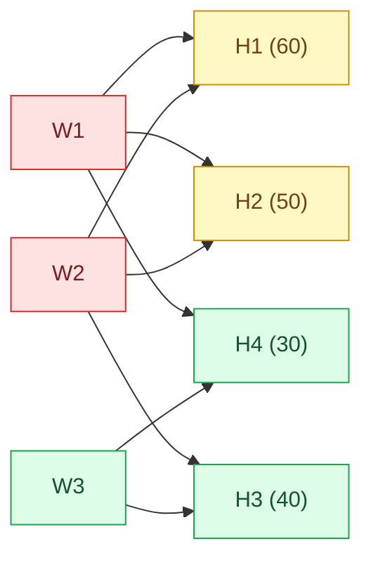
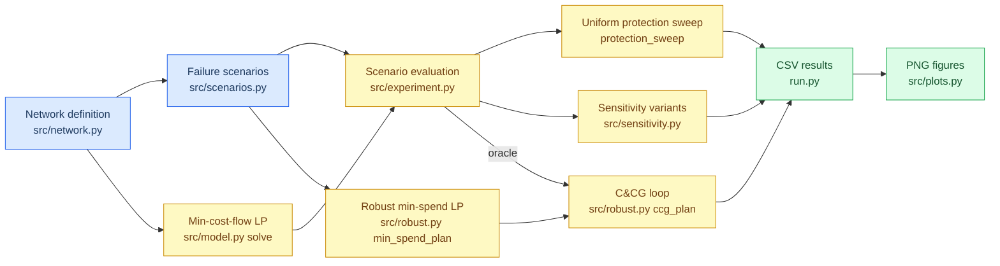

# Chapter 1 — Project overview

## The project 

A drug is produced from a supplier of raw materials via the manufacturing facility, warehouse, and finally hospital. When any one of those facilities shuts down, not enough of the drug goes to some hospitals.

The repository considers a small artificial four-level network, analyzes possible failure modes in detail, and asks a key question: How much is needed to build extra capacity at facilities before a failure in order to ensure that hospitals get their drugs in the worst case?

This question is answered in three different ways:

1. through uniform distribution of protection among facilities (naive policy);
2. by letting the optimizer allocate protection (two-stage robust optimization);
3. through validation of the optimizer's allocation by column-and-constraint generation, which uses exhaustive enumeration as a check.

The main result about the benchmark instance shows that the cost of having 100% worst-case coverage is 330 units if the protection is uniformly distributed, and 170 units if allocated by the optimizer, giving a 48% savings. Also, spending does not exceed 38.9% worst-case coverage in the case of failure of pairs of facilities because there are only two routes connecting two of the four hospitals to warehouses.

## The supply chain being studied

The network has four tiers, and material flows strictly left to right.

```mermaid
flowchart LR
    accTitle: Four-Tier Pharmaceutical Supply Chain Structure
    accDescr: Material flows from suppliers to factories to warehouses to hospitals. Suppliers, factories, and warehouses each have a capacity limit and can fail. Hospitals have demand and cannot fail.

    s["Suppliers<br/>capacity, can fail"]
    f["Factories<br/>capacity, can fail"]
    w["Warehouses<br/>capacity, can fail"]
    h["Hospitals<br/>demand, cannot fail"]

    s -->|"arcs with unit cost"| f
    f -->|"arcs with unit cost"| w
    w -->|"arcs with unit cost"| h

    classDef facility fill:#dbeafe,stroke:#2563eb,color:#1e3a5f
    classDef sink fill:#dcfce7,stroke:#16a34a,color:#14532d

    class s,f,w facility
    class h sink
```

| Tier | What it represents | Has capacity? | Has demand? | Can fail? |
|---|---|---|---|---|
| Suppliers | Active-ingredient producers | Yes | No | Yes |
| Factories | Formulation and packaging plants | Yes | No | Yes |
| Warehouses | Regional distribution centres | Yes | No | Yes |
| Hospitals | Points of consumption | No | Yes | No |

Only adjacent tiers are connected. There is no supplier-to-warehouse shortcut
and no arc within a tier. Every arc carries a **unit shipping cost** — the price
of moving one unit along it.

Hospitals are structurally different from the other three tiers: they are where
demand lives, and they are never treated as failing. Disrupting a hospital
would remove its demand rather than threaten supply, which is not the question
being asked. That asymmetry is enforced in
[`src/scenarios.py:4-5`](../src/scenarios.py), where the set of failable nodes
is explicitly suppliers plus factories plus warehouses.

## What a disruption means here

A disruption consists of the immediate loss of all facilities. In other words, the function fail_nodes in [`fail_nodes`](../src/experiment.py) in
`src/experiment.py:6-10` duplicates the network and sets the capacities of the failed nodes to zero. Node that is set to zero cannot carry any flow anymore and is effectively eliminated from the graph.

There are two kinds of disruptions considered:

- Single node failure – each of the nine non-hospital nodes fails independently, leading to nine scenarios. Generated by `single_node_failures` in [`src/scenarios.py:8-9`](../src/scenarios.py).
- Pairs of nodes failing simultaneously – every unordered pair of non-hospital nodes fails at the same time, creating 36 scenarios, as binomial(9, 2) = 36. Generated by `pair_failures` in
  [`src/scenarios.py:12-13`](../src/scenarios.py) 
As the sizes of both kinds are relatively small, they are enumerated explicitly. Thus, every worst case scenario presented is really the true worst case in the uncertainty set and not the estimate. The precision makes the example more useful to study the iterative algorithm.

All disruptions are binary (a node fails completely, no gradual deterioration); simultaneous (there are no sequences of cascading disruptions); and unweighted (all scenarios are equally likely). These assumptions are made on purpose, and their possible consequences are discussed in [Chapter 8](08-extension-guide.md).

## What protection means here

**Protection is capacity bought in advance.** Before you know which facility
will fail, you pay to raise some facilities' capacity. When a failure then
happens, the surviving facilities have enough headroom to absorb the rerouted
flow.

The price is linear: raising node $n$'s capacity by $e_n$ units costs
$r \cdot e_n$, with the rate $r$ fixed at `1.0` in
[`src/network.py:27`](../src/network.py).

Two policies are compared.

| | Uniform protection | Optimized protection |
|---|---|---|
| Decision | One number $p$: raise *every* capacity by a factor $(1+p)$ | One number $e_n$ per facility, chosen by an LP |
| Spend | $r \cdot p \cdot \sum_n u_n$ | $r \cdot \sum_n e_n$ |
| Knob | Protection level $p$ | Worst-case satisfaction target $\tau$ |
| Implemented in | `apply_protection`, `protection_spend` — `src/experiment.py:13-21` | `min_spend_plan`, `ccg_plan` — `src/robust.py:20-101` |
| Nature | A policy you evaluate | A policy you solve for |

Protection by uniformity is an ideal solution because it involves making choices without having any standard. This solution spends money on facilities where such spending is unnecessary. The other one optimizes spending and focuses only on those nodes which will really make a difference. For instance, in case of a built-in problem, there is no spending at all on facility F1 because its capacity of 90 units is enough.

## Why unmet demand is modelled explicitly

This is the crucial modeling choice for the repository.

The simple network flow model claims that the inflow to any hospital should be equal to its demand. Cutting off a supplier leads to infeasibility of the constraint and makes the solver return an infeasible result without providing useful information. Feasibility is necessarily binary when answering quantitative questions.

So the model adds a **shortage slack variable** $s_h \ge 0$ at every hospital
([`src/model.py:11`](../src/model.py)) and rewrites the demand constraint as

$$\text{inflow}(h) + s_h = d_h.$$

Thus, the model becomes always feasible: at worst case, the solver can claim that the whole demand was not met. However, the shortage is punished by a large coefficient $P = 1000$ in the objective function and hence, the delivery is preferred to the cost of shipment, but the shortage remains quantifiable.

The test `test_destroyed_node_reports_shortage_not_infeasible` in
[`tests/test_model.py:53-58`](../tests/test_model.py) pins exactly this
behaviour.

## The quantities being measured

Six distinct quantities appear throughout, and confusing them is the easiest way
to misread a result.

| Quantity | Meaning | Units | Where computed |
|---|---|---|---|
| **Shipping cost** | $\sum c_{ij} x_{ij}$ — the physical cost of moving goods | cost | `src/model.py:13, 39` |
| **Shortage cost** | $P \sum_h s_h$ — the penalty charged for undelivered demand | cost | part of the objective, `src/model.py:14` |
| **Cost** | Shipping + shortage; the LP objective value | cost | `src/model.py:38` |
| **Protection spend** | Money committed *before* the disruption | cost | `src/experiment.py:20-21`, `src/robust.py:65` |
| **Satisfaction** | Fraction of *total* demand delivered | dimensionless, 0 to 1 | `src/model.py:42` |
| **Equity (min fill rate)** | Fraction delivered to the *worst-served* hospital | dimensionless, 0 to 1 | `src/model.py:43` |
| **Recovery cost** | Disrupted cost minus intact cost, at the same protection level | cost | `src/experiment.py:34` |

Two of these deserve emphasis.

Two issues should be highlighted here.

First, protection expenditure is not considered in the LP problem of the base model. This is a different budgeting issue set before any scenario information. Adding protection expenditure to the scenario cost would imply comparing a one-off expense with a scenario-wise expense, which is not relevant in this case.

Satisfaction and equity can paint different pictures. Satisfaction is an average value, while equity is a minimum. In the built-in example, when we lose the supplier S3, we have satisfaction at a rather high level of 83.3%, but we allocate nothing to one hospital and have equity at 0.0 level. So if we optimize our policy for satisfaction only, we will cover this situation. There is an experiment in the repository called “The Equity Paradox Experiment” for exactly the same illustration. (see
[Chapter 6](06-experiments-and-results.md#experiment-6--the-equity-paradox)).

## The research question

> How should a protection budget be spent to guarantee worst-case demand
> satisfaction in a four-tier pharmaceutical network subject to single and
> paired facility disruptions, and how inefficient is uniform protection
> relative to optimized protection?

Three sub-questions follow from it, and each maps to an experiment:

1. *What does resilience cost?* → the uniform protection sweep, producing a
   cost–resilience curve.
2. *How much does intelligence save?* → the optimized frontier, compared point
   by point against the uniform curve.
3. *Is there a limit money cannot buy?* → the pair-failure sweep, which finds
   one.

## Why topology can impose a ceiling

This is the result that makes the project more than a costing exercise.

Under single failures, enough uniform protection eventually reaches 100%
worst-case satisfaction. Under *paired* failures it does not. The worst-case
satisfaction flattens at 38.9% from protection level $p = 0.2$ onward and never
improves, no matter how much more you spend.

The reason is structural. In the built-in network, hospitals `H1` and `H2` are
each reachable only from warehouses `W1` and `W2`:

Delete `W1` and `W2` and there is no path to `H1` or `H2` at all. Their combined
demand is $60 + 50 = 110$ out of a total of $180$, so the best achievable
satisfaction is $70/180 = 38.9\%$. Extra capacity cannot help: capacity is a
number attached to a node, and the problem is that the *arcs* are missing. This
is called a **structural cut**, and the flat region it produces is a
**topology-driven plateau**.

The practical reading: past a certain point, resilience stops being a budgeting
problem and becomes a network-design problem. You have to add a route, not
enlarge a facility.

## The main workflows

The repository has three entry points, each a standalone experiment.

| Entry point | Question it answers | Runtime (measured) | Artifacts |
|---|---|---|---|
| [`run.py`](../run.py) | The full study on the fixed 9-node instance | ~36 s, 1,623 LP solves | `sweep.csv`, `sensitivity.csv`, `frontier.csv`, `plans.csv`, `paradox.csv`, 4 PNGs |
| [`run_scaled.py`](../run_scaled.py) | Does any of this still work on a bigger, randomly generated network? | ~3 s at default size | `scaled.csv` |
| [`run_integrality.py`](../run_integrality.py) | Does the continuous protection LP ever give a fractional answer that a real integer plan cannot match? | ~1 s for 10 instances per γ | `integrality.csv` |

Note the C&CG loop's oracle is *exhaustive scenario evaluation* — it re-solves
every scenario each iteration. That makes the implementation a faithful and
verifiable teaching version of the algorithm, but it means C&CG here is not
faster than solving the full LP. On the default generated instance the full LP
took 0.13 s and C&CG took 3.15 s. Chapter 3 explains why, and why that is the
expected outcome rather than a defect.

---

Next: [Chapter 2 — Network and data model](02-network-and-data-model.md)
