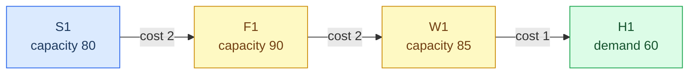
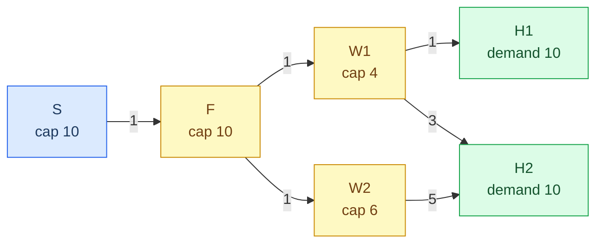

# Chapter 2 — Network and data model

Everything in this repository works on one data structure: a simple Python
dictionary representing a network. There is no class, no ORM, no schema library.
A network is a `dict`, functions work with `dict` and return a new `dict`, and the
solver accepts a `dict`. The knowledge of that dictionary is the key to understanding
the codebase.

## The network dictionary

```python
{
    "suppliers":            ["S1", "S2", "S3"],
    "factories":            ["F1", "F2", "F3"],
    "warehouses":           ["W1", "W2", "W3"],
    "hospitals":            ["H1", "H2", "H3", "H4"],
    "capacity":             {"S1": 80, ..., "W3": 60},
    "demand":               {"H1": 60, "H2": 50, "H3": 40, "H4": 30},
    "arc_cost":             {("S1", "F1"): 2, ...},
    "penalty":              1000,
    "protection_cost_rate": 1.0,
}
```

### Every key, in detail

| Key | Type | Meaning | Usage |
|---|---|---|---|
| `suppliers` | `list[str]` | Names of tier-1 nodes. Material sources. | `src/model.py:22`, `src/scenarios.py:5`, `src/robust.py:10, 42` |
| `factories` | `list[str]` | Names of tier-2 nodes. Transshipment with a capacity limit. | `src/model.py:24`, `src/scenarios.py:5`, `src/robust.py:10, 47` |
| `warehouses` | `list[str]` | Names of tier-3 nodes. Also transshipment with a limit. | `src/model.py:24`, `src/scenarios.py:5`, `src/robust.py:10, 47` |
| `hospitals` | `list[str]` | Names of tier-4 nodes. Demand sinks; never fail, never protected. | `src/model.py:6, 27`, `src/robust.py:22, 53` |
| `capacity` | `dict[str, float]` | Capacity limit per non-hospital node, in flow units. | `src/model.py:23, 26` |
| `demand` | `dict[str, float]` | Required delivery per hospital, in flow units. | `src/model.py:7, 28` |
| `arc_cost` | `dict[tuple[str, str], float]` | Cost per unit of flow shipped down an arc. Its **keys form the graph**. | `src/model.py:5, 10, 17, 20` |
| `penalty` | `float` | Cost charged per unit of undelivered demand. | `src/model.py:14` |
| `protection_cost_rate` | `float` | Cost per unit of extra capacity purchased. | `src/experiment.py:21`, `src/robust.py:30, 65` |

The types are nominal; nothing enforces the contract and a wrong dictionary is a
runtime error: either a `KeyError` from the solver, or a silently wrong answer.
The following invariants (which the solver relies upon) list what the dictionary
must satisfy.

### Arcs are dictionary keys, not a separate edge list

There is no `"arcs"` key. The set of arcs *is* `set(network["arc_cost"])`. An arc
is a 2-tuple `(source, destination)`, and the corresponding value is the unit cost
of flow down this arc.

That has one notable implication: **adding or removing an arc is done via adding
or removing entries in `arc_cost`; there is no other way.** This is because the
solver creates one flow variable per arc at
[`src/model.py:10`](../src/model.py):

```python
flow = {a: pulp.LpVariable(f"x_{a[0]}_{a[1]}", lowBound=0) for a in arcs}
```

and recreates the arc set for each node by iterating over the keys at
[`src/model.py:16-20`](../src/model.py):

```python
def inflow(node):
    return pulp.lpSum(flow[a] for a in arcs if a[1] == node)

def outflow(node):
    return pulp.lpSum(flow[a] for a in arcs if a[0] == node)
```

Each iteration takes $O(|A|)$ and there are $O(|N|)$ such iterations, so the
model building takes $O(|N| \cdot |A|)$; on the networks used here that is
immaterial, but on a large network that would be, and
[Chapter 8](08-extension-guide.md#scale-to-larger-networks) shows how to solve
it.

### Which nodes have capacity, which have demand

| | In `capacity`? | In `demand`? |
|---|---|---|
| Suppliers, factories, warehouses | Yes | No |
| Hospitals | **No** | Yes |

The hospitals are deliberately left out of `capacity`. Three features rely on this:

1. **`apply_protection` scales the whole `capacity` dictionary**
   ([`src/experiment.py:13-17`](../src/experiment.py)). The dictionary is
   iterated over `for node in protected["capacity"]` — not over the tier lists.
   If a hospital appeared in `capacity`, uniform protection would silently
   "protect" it.
2. **`protection_spend` sums the whole `capacity` dictionary**
   ([`src/experiment.py:20-21`](../src/experiment.py)). A hospital in there
   would inflate the protection spending of every result, shifting the whole
   cost-resilience curve to the right.
3. **The solver imposes no constraints on hospital capacity.** Hospitals appear
   only in the demand-balance constraint at [`src/model.py:27-28`](../src/model.py).
   A hospital is a sink; capping what it can receive would be a different model.

However, `_failable_nodes` at [`src/scenarios.py:4-5`](../src/scenarios.py) and
`_protectable` at [`src/robust.py:9-10`](../src/robust.py) both use the three
tier *lists* to build their sets of nodes, not `capacity`. So these two ways of
finding "all nodes" diverge only because the hospitals are kept out of
`capacity`. This is a subtle dependency and
[`tests/test_network.py:36-39`](../tests/test_network.py) verifies half of it.

### Layered structure assumptions

The tier lists are not just labels; the solver's constraint generation is
hard-coded around them ([`src/model.py:22-28`](../src/model.py)):

```python
for s in network["suppliers"]:
    prob += outflow(s) <= network["capacity"][s]      # sources: outflow-limited
for n in network["factories"] + network["warehouses"]:
    prob += inflow(n) == outflow(n)                    # transshipment: conserve
    prob += inflow(n) <= network["capacity"][n]        # ...and inflow-limited
for h in hospitals:
    prob += inflow(h) + unmet[h] == demand[h]          # sinks: balance with slack
```

Four assumptions follow:

- **There are exactly three node types: sources, transshipments, and sinks.**
  Adding a fifth tier requires inserting it into the `factories + warehouses`
  concatenation; otherwise that new tier will get no conservation and no capacity
  constraint — an unconstrained free node.
- **Capacity limit of suppliers is on *outflow*, while for intermediates — on *inflow*.**
  For transshipment nodes that does not matter; inflow equals outflow by conservation.
  But for suppliers it makes sense: they produce, not receive.
- **Material is conserved and homogenous.** A unit flowing in equals a unit flowing out.
  There is no yield loss, no product mix, no time.
- **Node adjacency is a convention, not a constraint.** The `solve` routine does
  not reject an arc that connects a supplier straight to a hospital. Such an arc
  would work mathematically but would bypass all intermediate capacity constraints.
  The layering is guaranteed only by how the network is *constructed* — and, in
  case of the fixed network, by
  [`tests/test_network.py:17-26`](../tests/test_network.py).

### Invariants the solver relies on

These are not checked at runtime. Violating them produces an error or a wrong answer.

| Invariant | Rationale | Symptom if violated |
|---|---|---|
| Each supplier/factory/warehouse appears in `capacity` | Directly indexed at `src/model.py:23, 26` | `KeyError` |
| Each hospital appears in `demand` | `src/model.py:28` | `KeyError` |
| `demand[h] > 0` for each hospital | Divisor in `min_fill_rate`, `src/model.py:43` | `ZeroDivisionError` |
| `sum(demand.values()) > 0` | Divisor in `satisfaction`, `src/model.py:42` | `ZeroDivisionError` |
| `hospitals` is non-empty | `min(...)` over an empty generator, `src/model.py:43` | `ValueError` |
| An arc has valid endpoint nodes | An arc with unknown source is a flow of unlimited supply | Silently inflated satisfaction |
| Tier lists are disjoint | A node appearing twice would have two incompatible constraint sets | Silently wrong results |
| `penalty` exceeds the cost of any single route | Otherwise the solver may choose to pay the shortage penalty over shipping | Silently wrong satisfaction |

The last one is much more important than it looks. The optimization problem relies
on the penalty being large enough that maximizing the delivery always dominates
saving the shipping cost. In the base network the most expensive route costs
$4+4+3=11$ per unit and the penalty is 1000 — roughly two orders of magnitude
of safety margin.
[Chapter 3](03-mathematical-model.md#why-the-penalty-must-be-large) formalizes
that requirement.

## Why transformation functions use `deepcopy`

Five routines create a modified network from a network:

| Routine | File | Modification |
|---|---|---|
| `fail_nodes` | `src/experiment.py:6-10` | Fails nodes by setting their capacity to 0 |
| `apply_protection` | `src/experiment.py:13-17` | Adds protection by scaling all capacities by $(1+p)$ |
| `apply_allocation` | `src/robust.py:13-17` | Increments capacity per node |
| `scale_costs` | `src/sensitivity.py:6-9` | Multiplies each arc cost by the factor |
| `scale_capacities` | `src/sensitivity.py:12-15` | Multiplies each capacity by the factor |

All of them start with `deepcopy(network)` and return a new dictionary. Two
reasons, and both are crucial.

**A shallow copy will not suffice.** `dict(network)` will create an outer
dictionary, but `capacity`, `demand`, and `arc_cost` in it will refer to the
same dictionaries in the original network. Mutating `copy["capacity"][node] = 0`
would thus affect the caller's network.

**These routines run in nested loops over the same base network.** In
`protection_sweep` ([`src/experiment.py:43-56`](../src/experiment.py)) the same
`base` is modified once per protection level, and in `evaluate_scenarios`
this modified network is modified again per scenario. If any of these modifications
leak, the protection level of 0.05 will silently depend on the protection
level of 0.00, and the 7th scenario will depend on the previous 6.
Such a sweep will complete successfully and generate numbers, but wrong ones;
no assertion on a single function call would catch that.

The test suite therefore verifies *purity* of these routines in addition to their
results. See `test_fail_nodes_zeroes_capacity_without_mutating_original`
([`tests/test_experiment.py:25-31`](../tests/test_experiment.py)): it copies the
input with `deepcopy` and asserts equality after calling. There are similar
assertions for the other four routines.

An exception: `base_network()` itself
([`src/network.py:79-90`](../src/network.py)) *does not* use `deepcopy`. It
recreates the dictionary with `list(SUPPLIERS)` and `dict(CAPACITY)` — shallow
copies of the module constants. It is sufficient because these inner containers
contain only immutable scalars, so shallow copy isolates the caller from the
module constants.
[`tests/test_network.py:50-54`](../tests/test_network.py) verifies the independence
of two calls.

## Walkthrough: one unit of flow from `S1` to `H1`

Consider the route $S1 \to F1 \to W1 \to H1$ in the base network and walk through
the cost and capacity consumption of one unit flowing along this route.



| Action | Dictionary entry | Implication for LP |
|---|---|---|
| Leaving `S1` | `capacity["S1"] = 80` | Consuming 1 out of 80 units of `S1` outflow budget |
| Traveling on `("S1", "F1")` | `arc_cost[("S1","F1")] = 2` | Objective increased by 2; variable `x_S1_F1` increased by 1 |
| Passing `F1` | `capacity["F1"] = 90` | Consuming 1 of 90 capacity of `F1`; conservation implies flow out |
| Traveling on `("F1", "W1")` | `arc_cost[("F1","W1")] = 2` | Objective increased by 2 |
| Passing `W1` | `capacity["W1"] = 85` | Consuming 1 of 85 capacity of `W1`; conservation implies flow out |
| Traveling on `("W1", "H1")` | `arc_cost[("W1","H1")] = 1` | Objective increased by 1 |
| Arriving at `H1` | `demand["H1"] = 60` | Delivering 1 of 60 required; slack `u_H1` decreased by 1 |

Unit cost: $2 + 2 + 1 = 5$. In fact, this is the cheapest route from supplier
to hospital in the network; the intact network uses it at full capacity: **60 units**
along this route contribute $300$ to the intact shipping cost of $940$
(`solve(base_network())`).

Optimum solution for the intact network, for reference:

| Arc | Flow | Unit cost | Contribution |
|---|---|---|---|
| `S1→F1` | 60 | 2 | 120 |
| `S2→F2` | 70 | 2 | 140 |
| `S3→F3` | 50 | 2 | 100 |
| `F1→W1` | 60 | 2 | 120 |
| `F2→W2` | 70 | 2 | 140 |
| `F3→W3` | 50 | 2 | 100 |
| `W1→H1` | 60 | 1 | 60 |
| `W2→H2` | 50 | 1 | 50 |
| `W2→H3` | 20 | 2 | 40 |
| `W3→H3` | 20 | 2 | 40 |
| `W3→H4` | 30 | 1 | 30 |
| | | **Total** | **940** |

Note that the optimum uses only the cheap "diagonal": each supplier flows only
to its own factory, each factory to its own warehouse. All other arcs have zero flow.
**That is precisely the fragility of the network:** the cost-optimal solution uses
the minimal number of arcs, hence has the minimal redundancy; one failure causes
an expensive rerouting.

## The fixed base network

Defined at [`src/network.py:1-27`](../src/network.py) as module constants, then
constructed by `base_network()` at [`src/network.py:79-90`](../src/network.py).

### Capacities and demands

| Tier | Nodes | Tier capacity | Total demand | Slack |
|---|---|---|---|---|
| Suppliers | S1: 80, S2: 70, S3: 60 | 210 | 180 | +30 |
| Factories | F1: 90, F2: 80, F3: 60 | 230 | 180 | +50 |
| Warehouses | W1: 85, W2: 75, W3: 60 | 220 | 180 | +40 |
| Hospitals | H1: 60, H2: 50, H3: 40, H4: 30 | 180 (demand) | — | — |

These numbers are not random — they satisfy a **calibration invariant**
that makes the whole study non-trivial:

$$\sum_{n \in T} u_n \;\ge\; D \quad\text{and}\quad \sum_{n \in T} u_n - \max_{n \in T} u_n \;<\; D \qquad \text{for every tier } T$$

Or, in words: *each tier has enough capacity to supply all demand, but not once it
loses its largest node.*

| Tier | Tier total | Tier total minus maximum | Smaller than 180? |
|---|---|---|---|
| Suppliers | 210 | $210 - 80 = 130$ | yes |
| Factories | 230 | $230 - 90 = 140$ | yes |
| Warehouses | 220 | $220 - 85 = 135$ | yes |

Both parts are essential. Without the first, the intact network would fail to meet
demand and every result would be biased by the baseline shortage. Without the second,
some losses would be costless and resilience would be meaningless for such nodes.
This invariant is asserted at
[`tests/test_network.py:42-47`](../tests/test_network.py), and its consequence —
that *any* loss causes a shortage — is asserted at
[`tests/test_experiment.py:18-22`](../tests/test_experiment.py).

### Arc costs and the connectivity pattern

20 arcs, costs from 1 to 4 ([`src/network.py:14-24`](../src/network.py)). The cost
numbers are selected so that every node has its own cheap "natural" connection
(cost 2) and one or two more expensive alternative connections (cost 3 or 4). That is
what makes rerouting expensive but feasible.

Connectivity by tier boundary:

| Boundary | Connectivity pattern | In-degree of each downstream node |
|---|---|---|
| Suppliers → Factories | Every supplier reaches 2 factories | F1←{S1,S3}, F2←{S1,S2}, F3←{S2,S3} — all 2 |
| Factories → Warehouses | Every factory reaches 2 warehouses | W1←{F1,F3}, W2←{F1,F2}, W3←{F2,F3} — all 2 |
| Warehouses → Hospitals | W1 and W2 reach 3 hospitals, W3 reaches 2 | H1←{W1,W2}, H2←{W1,W2}, H3←{W2,W3}, H4←{W1,W3} — all 2 |

The upper two boundaries are perfectly symmetric — a 3-cycle in which every node
has in-degree and out-degree 2. **All the asymmetry sits in the last boundary**,
and that is where the interesting structure lives.

### Structural bottlenecks

Three distinct bottlenecks shape every result in the project.

**1. Under low protection the single-failure bottleneck is `S1`.** `S1` holds the
largest supplier capacity (80). Losing it drops the supplier tier to 130 against
demand of 180, so at least 50 units go undelivered: satisfaction is
$130/180 \approx 72.2\%$. That is the worst single failure at zero protection,
as verified by `solve(fail_nodes(base_network(), ("S1",)))`.

**2. Once protection is added the bottleneck moves to `W1`.** By protection level
$p = 0.30$ the binding failure is `W1`, not `S1` — see `sweep.csv`. Protection
factors multiply every resource in the same way. Hence they close the supplier
gap and the warehouse gap at different speeds. The conclusion is immediate:
**the most important facility ranking is true only at a particular protection
budget level.** To rank facilities of the unprotected network, you would allocate
too much capacity to `S1`.

**3. The bottleneck cut for pair failure is `{W1, W2}`, and it is
permanent.** As seen in the in-degree table above, hospitals `H1` and `H2`
are supplied only by warehouses `W1` and `W2`. Removing them removes every
path to the two hospitals, cutting off $60 + 50 = 110$ out of 180 demand
units. The maximum satisfaction is limited to $70/180 \approx 38.9\%$
**irrespective of how much protection money you can afford,** because
capacity is a node attribute and the removed resource is an arc. Compare the
pair sweep results in `sweep.csv`: from $p = 0.2$ onwards, the `worst_scenario_pairs`
value is fixed at `W1+W2` and `worst_satisfaction_pairs` at `0.38888...`, and
they stay so through $p = 0.5$.

That is why [`tests/test_robust.py:48-51`](../tests/test_robust.py)
asserts that demanding 100% satisfaction against pair failures results in
`Infeasible` status code — no allocation of additional capacity will ever
deliver that, and the LP knows it.

## Other three network instances

Four network generators are defined in the repository, differing in
purpose, not just in size.

| Instance | Where | Tiers (S/F/W/H) | Arcs | Demand | Satisfaction intact | Purpose |
|---|---|---|---|---|---|---|
| `base_network()` | `src/network.py:79-90` | 3/3/3/4 | 20 | 180 | 100% | The main instance used for research |
| `equity_paradox_network()` | `src/network.py:30-46` | 1/1/2/2 | 6 | 20 | 50% | Minimal instance where increasing satisfaction decreases equity |
| `integrality_gap_network()` | `src/network.py:49-76` | 3/4/4/4 | 29 | 115 | 89.6% | Network to demonstrate an integrality gap |
| `random_layered_network(rng, sizes)` | `src/generator.py:4-42` | configurable | varies | varies | varies | Arbitrary-size networks for scaling and statistical studies |

### `equity_paradox_network` — deliberately undersupplied



Three things make the paradox possible:

1. **Supply is deliberately low.** Supplier and factory limit the network
   capacity to 10 against demand of 20. Satisfaction cannot possibly get
   above 50% without protection. In contrast to the base network, this instance
   is *not* calibrated to be able to serve demand intact.
2. **The only path to `H1` goes through `W1`.** There is no arc `W2 → H1`.
   Capacity 4 of `W1` is an upper bound on `H1`'s service.
3. **The route to `H1` is cheap, while the route to `H2` through `W2` is
   expensive** (unit cost 3 versus 7). Therefore, the cost-minimizing optimizer
   prefers to serve `H1` as long as it is possible.

In the absence of protection, the optimum serves 4 units to `H1` using `W1`
and 6 to `H2` via `W2`: 50% satisfaction and 40% equity
([`tests/test_paradox.py:8-12`](../tests/test_paradox.py)).

Raise the target satisfaction to 55% and protect accordingly. The optimizer
will increase the capacity of `S`, `F`, and `W1` by 1, 1, and 7 units,
respectively. The budget is 9, allowing for 11 units served: `H1` will get
its full 10 and `H2` will receive 1. Satisfaction will rise to 55% whereas
equity **drops to 10%**
([`tests/test_paradox.py:15-21`](../tests/test_paradox.py), `paradox.csv`).

The mathematical reason is clear: as stated in
[Chapter 3](03-mathematical-model.md#the-target-constraint-is-aggregate),
the robust target constraint limits the *sum* of unmet demand
([`src/robust.py:55`](../src/robust.py)) and says nothing about how that
shortfall is distributed between the hospitals.

### `integrality_gap_network` — a pinned counterexample

15-node instance, where the supplier tier (total capacity 103) is *less*
than total demand (115), so reaching full satisfaction under every single
failure requires buying supplier capacity. The purpose of this instance is
narrow: on this network, the relaxed solution of the protection problem spends
**106.5** and the integer solution — **107.0** — giving the exact
gap of 0.5. It is asserted at
[`tests/test_integrality.py:35-40`](../tests/test_integrality.py) and tested further at
lines 43-49 to confirm that the fractional solution is feasible for
every single failure scenario, so the gap is real rather than a solver artefact.

### `random_layered_network` — generated instances

Generated by [`src/generator.py:4-42`](../src/generator.py)
with a `random.Random` instance as input. Same dict structure with
four tiers but:

- Tier sizes are configurable with `sizes=(nS, nF, nW, nH)`
  (default: draw 3–4 nodes for each of first three tiers, 2–4 hospitals
  ([`src/generator.py:6`](../src/generator.py))).
- Capacities are uniform from 20 to 100, demands — from 10 to 60, costs —
  from 1 to 5 ([`src/generator.py:13-23`](../src/generator.py)).
- Every upstream node gets 2 to `min(4, |downstream|)` outgoing arcs, then a
  repair pass ensures that each downstream node has at least
  `min(2, |upstream|)` incoming arcs
  ([`src/generator.py:24-30`](../src/generator.py)).

There are two things that are *guaranteed* to be met during generation and
asserted at
[`tests/test_generator.py`](../tests/test_generator.py):

- Arcs connect adjacent tiers only.
- Every node has the required number of neighbours.

There are two things **not** guaranteed:

- **Feasibility.** Nothing is forced to ensure the capacity is greater than
  demand, hence a generated network might fail to serve demand even intact.
  Integrality test confirms this: at the pair failure setting, only 6 of 10
  networks were feasible.
- **Calibration invariant.** Unlike the base network, a generated one
  might have free-of-cost failure scenarios. The scaled run testifies of
  this: at default sizes only 2 of 30 single failures cause shortage,
  compared to 9 of 9 on the base network.

Having a size 1 tier in any downstream position raises `ValueError: empty
range in randint(2, 1)`, as the draw of out-degree at
[`src/generator.py:21`](../src/generator.py) needs at least 2 downstream
candidates. A *supplier* tier of size 1 is fine. Both were checked directly:
`sizes=(1,3,3,3)` succeeds, `sizes=(3,3,3,1)` raises.

---

Previous: [Chapter 1 — Project overview](01-project-overview.md) ·
Next: [Chapter 3 — Mathematical model](03-mathematical-model.md)
