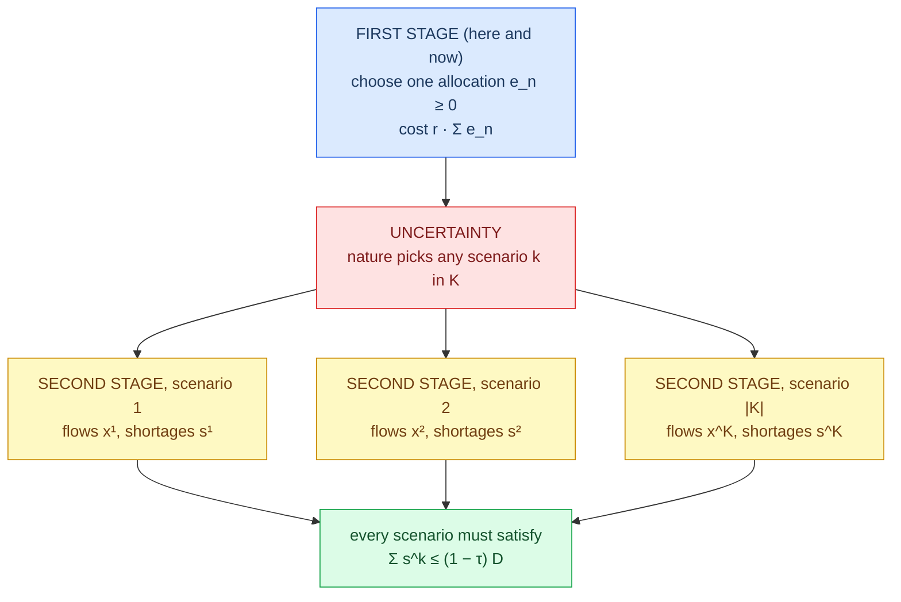
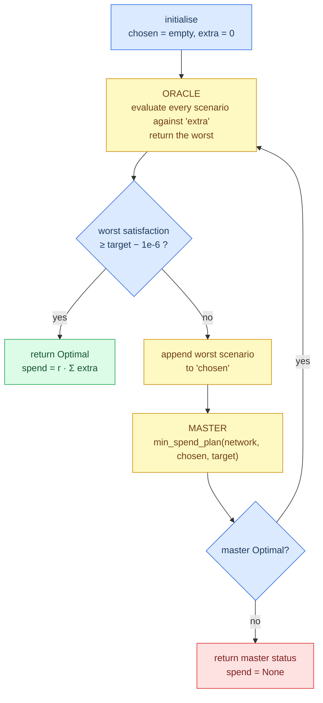

# Chapter 3 — Mathematical model

This chapter reconstructs, from the source, the optimization models the
repository actually solves. Three models appear, each building on the last:

1. the **base min-cost-flow LP** — evaluates one network under one disruption;
2. the **min-spend robust LP** — chooses where to buy protection so that *every*
   scenario meets a target;
3. the **C&CG loop** — reaches the same answer by adding scenarios one at a time.

## A short primer on linear programming

If you have not met LP before, the idea is small.

You have some quantities you get to choose — here, how much medicine to send
down each road. Call them **decision variables**. You have rules they must obey,
each written as a linear inequality — a warehouse cannot handle more than 85
units. Call those **constraints**. And you have one linear expression you want to
make as small as possible — total cost. Call that the **objective**.

An LP solver takes those three things and returns the choice of variables that
minimizes the objective while obeying every constraint, together with a proof
that no better choice exists. This repository uses **PuLP**, a Python library
that lets you write the model in ordinary Python and hands it to the **CBC**
solver, which ships with PuLP and needs no separate install.

In PuLP the pattern is always the same:

```python
prob = pulp.LpProblem("name", pulp.LpMinimize)   # a problem to minimize
x    = pulp.LpVariable("x", lowBound=0)          # a variable, x >= 0
prob += 3 * x                                    # first += sets the objective
prob += x <= 10                                  # later += adds constraints
prob.solve(pulp.PULP_CBC_CMD(msg=0))             # msg=0 silences the solver
x.value()                                        # read the answer
```

The `+=` operator does double duty: the *first* one sets the objective, every
one after adds a constraint. That is why in
[`src/model.py`](../src/model.py) the objective at line 14 must come before the
constraints at lines 22-28.

## Notation

All three models share this notation. Nothing below is used before it is defined
here.

### Sets

| Symbol | Meaning | In code |
|---|---|---|
| $S$ | Suppliers | `network["suppliers"]` |
| $F$ | Factories | `network["factories"]` |
| $W$ | Warehouses | `network["warehouses"]` |
| $M = F \cup W$ | Intermediate facilities (transshipment nodes) | `network["factories"] + network["warehouses"]` |
| $H$ | Hospitals | `network["hospitals"]` |
| $N = S \cup M$ | Failable and protectable nodes | `_failable_nodes` (`src/scenarios.py:4-5`), `_protectable` (`src/robust.py:9-10`) |
| $A$ | Directed arcs, $A \subseteq (S \times F) \cup (F \times W) \cup (W \times H)$ | `network["arc_cost"].keys()` |
| $K$ | Index set of disruption scenarios | the `scenarios` argument |
| $\Phi_k \subseteq N$ | The set of nodes that fail in scenario $k$ | one tuple from `single_node_failures` or `pair_failures` |

For single failures $|\Phi_k| = 1$ and $|K| = |N| = 9$; for pairs
$|\Phi_k| = 2$ and $|K| = \binom{9}{2} = 36$.

### Parameters

| Symbol | Meaning | Units | In code |
|---|---|---|---|
| $u_n$ | Capacity of node $n \in N$ | flow units | `network["capacity"][n]` |
| $d_h$ | Demand of hospital $h$ | flow units | `network["demand"][h]` |
| $D = \sum_{h \in H} d_h$ | Total demand (180 on the base network) | flow units | `sum(demand.values())` |
| $c_{ij}$ | Unit shipping cost on arc $(i,j)$ | cost / flow unit | `network["arc_cost"][(i,j)]` |
| $P$ | Shortage penalty (1000) | cost / flow unit | `network["penalty"]` |
| $r$ | Protection cost rate (1.0) | cost / capacity unit | `network["protection_cost_rate"]` |
| $\tau$ | Target worst-case satisfaction | dimensionless, $[0,1]$ | the `target` argument |
| $p$ | Uniform protection level | dimensionless | the `level` argument |

### Decision variables

| Symbol | Domain | Meaning | In code |
|---|---|---|---|
| $x_{ij}$ | $\ge 0$, continuous | Flow shipped along arc $(i,j)$ | `flow[a]`, `src/model.py:10` |
| $s_h$ | $\ge 0$, continuous | Unmet demand at hospital $h$ (shortage slack) | `unmet[h]`, `src/model.py:11` |
| $e_n$ | $\ge 0$, continuous **or integer** | Extra capacity purchased at node $n$ | `extra[n]`, `src/robust.py:29` |

$x$ and $s$ are **second-stage** (recourse) variables: chosen after the
disruption is known. $e$ is a **first-stage** variable: chosen before, and shared
across all scenarios.

## The base min-cost-flow model

Implemented by `solve` in [`src/model.py:4-44`](../src/model.py). One call solves
one network — intact or already disrupted — and returns both the cost and the
resilience metrics.

### Objective

$$\min \;\; \underbrace{\sum_{(i,j) \in A} c_{ij}\, x_{ij}}_{\text{shipping cost}} \;+\; \underbrace{P \sum_{h \in H} s_h}_{\text{shortage cost}}$$

**Intuition.** Move the medicine as cheaply as you can, but treat every
undelivered unit as costing $P$ — a price so high that the solver will accept
almost any detour rather than leave demand unserved.

**Implementation** ([`src/model.py:13-14`](../src/model.py)):

```python
shipping = pulp.lpSum(cost * flow[a] for a, cost in arcs.items())
prob += shipping + network["penalty"] * pulp.lpSum(unmet.values())
```

`shipping` is kept as a separate Python expression so it can be evaluated on its
own afterwards and reported as `shipping_cost`
([`src/model.py:39`](../src/model.py)) — that is how the documentation can say
"of the 50,700 total, only 700 was shipping."

### Supplier capacity

$$\sum_{j \,:\, (s,j) \in A} x_{sj} \;\le\; u_s \qquad \forall s \in S$$

**Intuition.** A supplier cannot ship out more than it can produce.

**Implementation** ([`src/model.py:22-23`](../src/model.py)):

```python
for s in network["suppliers"]:
    prob += outflow(s) <= network["capacity"][s]
```

Note this bounds *outflow*. Suppliers have no inflow — they are the sources.
Setting $u_s = 0$ (what `fail_nodes` does) forces all of a failed supplier's
outgoing arcs to zero, which is exactly the "node deleted" semantics.

### Flow conservation at intermediate nodes

$$\sum_{i \,:\, (i,n) \in A} x_{in} \;=\; \sum_{j \,:\, (n,j) \in A} x_{nj} \qquad \forall n \in M$$

**Intuition.** Nothing is created, consumed, or stored at a factory or a
warehouse. Whatever arrives leaves.

**Implementation** ([`src/model.py:24-25`](../src/model.py)):

```python
for n in network["factories"] + network["warehouses"]:
    prob += inflow(n) == outflow(n)
```

This is the constraint that makes the model a *network*. Without it, each tier
boundary would be an independent transportation problem and a disruption at one
tier could not propagate to another.

### Intermediate node capacity

$$\sum_{i \,:\, (i,n) \in A} x_{in} \;\le\; u_n \qquad \forall n \in M$$

**Intuition.** A factory or warehouse can only handle so much throughput.

**Implementation** ([`src/model.py:26`](../src/model.py)):

```python
    prob += inflow(n) <= network["capacity"][n]
```

Because conservation already forces inflow to equal outflow, bounding inflow
also bounds outflow. Writing it on inflow rather than outflow is a modelling
choice with no mathematical consequence here.

### Hospital demand balance with shortage slack

$$\sum_{i \,:\, (i,h) \in A} x_{ih} \;+\; s_h \;=\; d_h \qquad \forall h \in H$$

**Intuition.** Everything a hospital needs is either delivered or recorded as a
shortage. There is no third option.

**Implementation** ([`src/model.py:27-28`](../src/model.py)):

```python
for h in hospitals:
    prob += inflow(h) + unmet[h] == demand[h]
```

### Non-negativity

$$x_{ij} \ge 0 \quad \forall (i,j) \in A, \qquad s_h \ge 0 \quad \forall h \in H$$

**Implementation** — declared on the variables themselves via `lowBound=0`
([`src/model.py:10-11`](../src/model.py)), not as separate constraints. Flow
cannot run backwards along an arc, and you cannot have negative shortage.

### Why the shortage slack keeps disrupted models feasible

Drop $s_h$ and the demand constraint becomes $\sum_i x_{ih} = d_h$: an exact
requirement. Set a supplier's capacity to zero and total available supply may
fall below $D$, at which point no assignment of flows satisfies every hospital
and the solver returns `Infeasible`.

`Infeasible` is a Boolean. The whole project needs a *number* — how bad is it? —
so the slack converts the hard constraint into a soft one. The feasible region is
now never empty: setting $x = 0$ and $s_h = d_h$ is always feasible, whatever the
capacities. The solver's answer is therefore always a well-defined shortage
vector, and every resilience metric is a function of that vector.

`test_destroyed_node_reports_shortage_not_infeasible`
([`tests/test_model.py:53-58`](../tests/test_model.py)) is the regression test
for exactly this property.

### Why the penalty must be large

The penalty $P = 1000$ is set at [`src/network.py:26`](../src/network.py). Its
job is to make the LP behave **lexicographically**: first maximize total
delivery, then minimize shipping cost among all maximum-delivery solutions.

**Why that follows.** Suppose an optimal solution leaves some demand unmet while
a feasible rearrangement could deliver one more unit. Making that rearrangement
changes the objective by

$$-P \;+\; (\text{change in shipping cost}).$$

Any single-unit rearrangement uses each arc at most once, so the shipping change
is bounded above by $\sum_{(i,j) \in A} c_{ij}$. Therefore if

$$P \;>\; \sum_{(i,j) \in A} c_{ij}$$

the rearrangement strictly improves the objective — contradicting optimality. So
no optimal solution can leave deliverable demand unmet.

On the base network $\sum c_{ij} = 47$, and the tightest practically relevant
bound is smaller still: the most expensive supplier-to-hospital route costs
$4 + 4 + 3 = 11$ per unit. Against $P = 1000$ there is roughly two orders of
magnitude of headroom, so the ordering is never in doubt.

The practical consequence, visible everywhere in the results: **worst-case
satisfaction is driven entirely by capacity, and not at all by shipping cost.**
That is why scaling every arc cost by ±20% leaves the trade-off curve exactly
unchanged — see
[Chapter 6](06-experiments-and-results.md#experiment-3--sensitivity-analysis)
and `test_cost_scaling_leaves_satisfaction_curve_unchanged`
([`tests/test_sensitivity.py:34-40`](../tests/test_sensitivity.py)).

The flip side is a limitation: this model cannot express a genuine cost-versus-
service trade-off at the operational level, because service always wins. Making
$P$ comparable to shipping costs would produce a different — and, on this
instance, degenerate — model.

## Metrics

Both metrics are computed in `solve` and returned in its dictionary.

### Demand satisfaction

$$\text{satisfaction} \;=\; 1 - \frac{\sum_{h \in H} s_h}{\sum_{h \in H} d_h} \;=\; 1 - \frac{\sum_h s_h}{D}$$

The fraction of *total* demand that was delivered. Implemented at
[`src/model.py:42`](../src/model.py):

```python
"satisfaction": 1 - total_unmet / total_demand,
```

Range $[0, 1]$: 1 means every hospital was fully served, 0 means nothing was
delivered anywhere.

### Minimum fill rate (equity)

Define hospital $h$'s **fill rate** as the fraction of *its own* demand it
received:

$$\text{fill}_h \;=\; 1 - \frac{s_h}{d_h}$$

The equity metric is the worst of them:

$$\text{min fill rate} \;=\; \min_{h \in H}\left(1 - \frac{s_h}{d_h}\right)$$

Implemented at [`src/model.py:43`](../src/model.py):

```python
"min_fill_rate": min(1 - unmet_values[h] / demand[h] for h in hospitals),
```

This is a **max-min** (Rawlsian) criterion: it judges an outcome by its
worst-off participant.

### Why the two metrics disagree

Satisfaction is a **demand-weighted average** of fill rates:

$$\text{satisfaction} \;=\; \sum_{h \in H} \frac{d_h}{D}\,\text{fill}_h$$

An average is insensitive to how the shortfall is distributed. Concentrating all
of it on one hospital, or spreading it evenly, gives the same satisfaction. The
minimum is maximally sensitive to exactly that.

It follows immediately that $\text{min fill rate} \le \text{satisfaction}$
always — a fact asserted for every scenario in
[`tests/test_experiment.py:61-66`](../tests/test_experiment.py). The gap between
them is the inequity.

The concrete case: losing supplier `S3` on the base network gives satisfaction
83.3% and min fill rate **0.0** — one hospital gets nothing at all while the
headline number still looks respectable (`plans.csv`, row `S3`).

### The target constraint is aggregate

This is the single most consequential fact about the robust model, so it is
stated here rather than buried below. The robust LP's resilience requirement is
written on *total* unmet demand ([`src/robust.py:55`](../src/robust.py)):

```python
prob += pulp.lpSum(unmet.values()) <= (1 - target) * total_demand
```

That is $\sum_h s^k_h \le (1-\tau)D$, i.e. **satisfaction** $\ge \tau$. It says
nothing whatsoever about $\min_h \text{fill}_h$. The optimizer is therefore free
to meet its target by serving cheap hospitals completely and abandoning
expensive ones — which is precisely what the equity-paradox instance is built to
demonstrate. Equity is *measured* everywhere in this project and *constrained*
nowhere.

## Uniform protection

The baseline policy. One scalar $p$, applied to everything.

### Transformation

$$u'_n \;=\; (1 + p)\, u_n \qquad \forall n \in N$$

**Implementation** ([`src/experiment.py:13-17`](../src/experiment.py)):

```python
def apply_protection(network, level):
    protected = deepcopy(network)
    for node in protected["capacity"]:
        protected["capacity"][node] = network["capacity"][node] * (1 + level)
    return protected
```

The loop runs over the keys of `capacity`, not over the tier lists — see
[Chapter 2](02-network-and-data-model.md#which-nodes-have-capacity-which-have-demand)
for why that distinction matters.

### Spend

$$\text{spend}(p) \;=\; r \cdot p \cdot \sum_{n \in N} u_n$$

**Implementation** ([`src/experiment.py:20-21`](../src/experiment.py)):

```python
def protection_spend(network, level):
    return network["protection_cost_rate"] * level * sum(network["capacity"].values())
```

The spend is computed from the *base* network's capacities, so it is linear in
$p$ and independent of the order in which levels are evaluated
([`tests/test_experiment.py:43-49`](../tests/test_experiment.py)).

On the base network $\sum_n u_n = 210 + 230 + 220 = 660$, so with $r = 1$ the
spend is simply $660p$: level 0.05 costs 33, level 0.5 costs 330. Those are the
numbers in the `spend` column of `sweep.csv`.

## Optimized protection: the two-stage robust model

Now the model chooses the allocation instead of being handed one.

### The two-stage structure



The distinction that matters:

| | Count | Shared across scenarios? | Chosen when? |
|---|---|---|---|
| Protection $e_n$ | $|N|$ variables | **Yes — one common allocation** | Before the disruption |
| Flows $x^k_{ij}$ | $|K| \times |A|$ variables | **No — a separate set per scenario** | After, with full knowledge of $k$ |
| Shortages $s^k_h$ | $|K| \times |H|$ variables | No — one set per scenario | After |

You buy one plan; you get to re-route freely once you see what broke. That
freedom to re-route is called **recourse**, and it is why the answer is much
cheaper than protecting against every failure independently.

### Scenario-adjusted capacity

For scenario $k$, node $n$'s effective capacity is

$$\hat u^k_n \;=\; \begin{cases} 0 & \text{if } n \in \Phi_k \quad(\text{node failed}) \\[4pt] u_n + e_n & \text{otherwise} \end{cases}$$

A failed node's capacity is zero *regardless of how much protection was bought
there*. Protection cannot save a facility that has been destroyed; it only helps
the survivors absorb the load. In code this is the `if s in failed` branch at
[`src/robust.py:43-52`](../src/robust.py).

### The full formulation

$$
\begin{aligned}
\min_{e,\,x,\,s} \quad & r \sum_{n \in N} e_n \\[6pt]
\text{s.t.} \quad
& \sum_{j:(s,j) \in A} x^k_{sj} \;\le\; \hat u^k_s
&& \forall s \in S,\; \forall k \in K \\
& \sum_{i:(i,n) \in A} x^k_{in} \;=\; \sum_{j:(n,j) \in A} x^k_{nj}
&& \forall n \in M,\; \forall k \in K \\
& \sum_{i:(i,n) \in A} x^k_{in} \;\le\; \hat u^k_n
&& \forall n \in M,\; \forall k \in K \\
& \sum_{i:(i,h) \in A} x^k_{ih} + s^k_h \;=\; d_h
&& \forall h \in H,\; \forall k \in K \\
& \sum_{h \in H} s^k_h \;\le\; (1 - \tau) D
&& \forall k \in K \\
& e_n \ge 0,\quad x^k_{ij} \ge 0,\quad s^k_h \ge 0. &&
\end{aligned}
$$

**Read it as:** *buy the cheapest set of capacity upgrades such that, for every
single disruption you care about, there exists a way to route the survivors'
output that leaves at most $(1-\tau)D$ units undelivered.*

Note there is **no shipping cost and no penalty** in this objective. Shipping
cost is irrelevant here — the target constraint is about physical delivery, and
the second-stage variables only need to *exist*, not to be cheap. The recourse
LP is a pure feasibility question.

### Why this is one LP and not a min-max

The textbook two-stage robust problem is

$$\min_{e \ge 0}\; r\sum_n e_n \quad \text{s.t.} \quad \max_{k \in \mathcal{U}} \; \big(\text{worst recourse outcome}\big) \le \text{tolerance},$$

with $\mathcal{U}$ an uncertainty set typically described implicitly (for example
"any $\Gamma$ nodes may fail"). That inner maximization makes the problem
non-convex and is what forces iterative algorithms.

Here $\mathcal{U}$ is given **explicitly as a finite list** — the `scenarios`
argument. A constraint that must hold for the worst member of a finite set is
identical to the same constraint imposed on every member. So the min-max
collapses into a single large LP with one copy of the recourse problem per
scenario. This is called the **extensive form** or **deterministic equivalent**.

That collapse is what makes this repository's exhaustive results *exact*, and it
is why they can serve as ground truth for validating C&CG.

### Implementation

`min_spend_plan` at [`src/robust.py:20-67`](../src/robust.py). The loop at line
32 builds a fresh copy of the recourse model per scenario:

```python
for i, failed in enumerate(scenarios):
    flow = {a: pulp.LpVariable(f"x{i}_{a[0]}_{a[1]}", lowBound=0) for a in arcs}
    unmet = {h: pulp.LpVariable(f"u{i}_{h}", lowBound=0) for h in hospitals}
    ...
```

The scenario index `i` is baked into every variable name (`x0_S1_F1`,
`x1_S1_F1`, ...) so that PuLP treats them as distinct variables. The `extra`
variables, created once before the loop at line 29, are *not* indexed — that is
the mechanical realisation of "one common allocation."

Model size grows as $|K| \cdot (|A| + |H|) + |N|$ variables. For the base network
with single failures: $9 \times (20 + 4) + 9 = 225$ variables. With pair
failures: $36 \times 24 + 9 = 873$.

On infeasibility the function returns early with `spend` and `extra` set to
`None` ([`src/robust.py:59-60`](../src/robust.py)) rather than raising — callers
must check `status`. `test_pair_target_above_topology_limit_is_infeasible`
([`tests/test_robust.py:48-51`](../tests/test_robust.py)) exercises that path,
using the $\{W1, W2\}$ structural cut described in
[Chapter 2](02-network-and-data-model.md#structural-bottlenecks).

## Column-and-constraint generation

### The intuition

Building one LP with a copy of the recourse problem for all $|K|$ scenarios is
fine when $|K| = 9$. When the uncertainty set has millions of members it is
hopeless.

But observe: in the solved plan, most scenarios are slack — they meet the target
comfortably and their constraints could be deleted without changing the answer.
Only a handful are **binding**. If you knew which ones in advance you could build
a much smaller LP.

C&CG (Zeng & Zhao, 2013) finds them by guessing and correcting:

> Solve a small problem with the scenarios you have. Ask an **oracle** for the
> single worst scenario against that solution. If the oracle's answer already
> meets the target, you are done and provably optimal. If not, add that scenario
> and repeat.

Each round adds the scenario that most embarrasses the current plan. The set of
scenarios that ever gets added is a superset of the binding ones and, in
practice, not much larger.

### The loop



### Pseudocode

This corresponds line for line to `ccg_plan`,
[`src/robust.py:70-101`](../src/robust.py).

```text
function ccg_plan(network, scenarios, target):
    chosen     ← []                                            # line 71
    extra      ← { n: 0.0  for n in protectable(network) }      # line 72
    iterations ← 0                                              # line 73

    loop forever:                                               # line 74
        iterations ← iterations + 1                             # line 75
        protected  ← apply_allocation(network, extra)           # line 76

        # ---- ORACLE: exhaustive evaluation over the whole uncertainty set
        (worst_value, worst_nodes) ←                            # lines 77-83
            min over k in scenarios of
                ( solve(fail_nodes(protected, k)).satisfaction , k )

        # ---- STOPPING CONDITION
        if worst_value ≥ target − 1e-6:                         # line 84
            return { status:     "Optimal",
                     spend:      rate × Σ extra,                # line 85
                     extra:      extra,
                     iterations: iterations }                   # lines 86-91

        # ---- SCENARIO ADDITION
        chosen.append(worst_nodes)                              # line 92

        # ---- MASTER PROBLEM over the accumulated subset only
        plan ← min_spend_plan(network, chosen, target)          # line 93

        if plan.status ≠ "Optimal":                             # line 94
            return { status: plan.status, spend: None,
                     extra:  None, iterations: iterations }     # lines 95-100

        extra ← plan.extra                                      # line 101
```

Four pieces deserve comment.

**The master problem** is just `min_spend_plan` called on the *subset* `chosen`
instead of on all of `scenarios`. There is no separate master implementation.
Because it sees fewer constraints, its optimum is a **relaxation**: its spend is
a valid lower bound on the true optimal spend.

**The oracle** is exhaustive: it calls `solve` once per scenario in the *full*
set, every iteration. It is exact — it genuinely returns the worst scenario —
but it costs $|K|$ LP solves per iteration.

**The stopping condition** at line 84 uses a tolerance of `1e-6`. Without it,
floating-point noise in the CBC solution could leave `worst_value` at, say,
$0.9999999997$ against a target of $1.0$, and the loop would add a scenario that
is already satisfied. The same tolerance appears in the tests
([`tests/test_robust.py:62`](../tests/test_robust.py)).

**Failure propagation**: if the master is infeasible on the accumulated subset,
the whole problem is infeasible (a subset's infeasibility implies the full set's),
so returning the master's status is correct.

### Why it converges, and why it is optimal

**Termination.** Every iteration except the last appends one scenario to
`chosen`. Can the same scenario be appended twice? No. After scenario $k$ is
added, the master enforces $\sum_h s^k_h \le (1-\tau)D$ for it, so a feasible
routing achieving satisfaction $\ge \tau$ *exists* under the new allocation. The
oracle's `solve` finds a maximum-delivery routing (because $P$ is large — see
[above](#why-the-penalty-must-be-large)), so it will report satisfaction
$\ge \tau$ for $k$, and $k$ can never again be the strict minimum below target.
Hence at most $|K| + 1$ iterations.

**Optimality.** The master's spend is a lower bound on the true optimum, and it
is non-decreasing across iterations because constraints are only ever added.
When the oracle certifies that the current allocation meets the target against
*every* scenario, that allocation is feasible for the full problem — so its cost
is also an upper bound. Lower bound meets upper bound; the answer is optimal.

`test_ccg_matches_exhaustive_lp_spend`
([`tests/test_robust.py:54-62`](../tests/test_robust.py)) checks this empirically
against the full LP at targets 0.9 and 1.0.

### A traced run

Running the loop on the base network with single failures and $\tau = 1.0$
produces this sequence (verified by instrumenting a replica of `ccg_plan`):

| Iter | Oracle's worst scenario | Its satisfaction | Master spend after adding |
|---|---|---|---|
| 1 | `S1` | 0.7222 | 50 |
| 2 | `W1` | 0.7500 | 95 |
| 3 | `F1` | 0.7778 | 135 |
| 4 | `S2` | 0.8333 | 135 |
| 5 | `W2` | 0.8611 | 160 |
| 6 | `S3` | 0.8889 | 170 |
| 7 | `F2` | **0.8333** | 170 |
| 8 | `F3` | 0.9444 | 170 |
| 9 | `S1` | **1.0000** | — stop |

Three things to read off it:

- **The master spend is monotone non-decreasing** (0, 50, 95, 135, 135, 160, 170,
  170, 170) — the lower bound tightening as predicted.
- **The oracle's worst-case value is *not* monotone.** It drops at iteration 7,
  from 0.8889 to 0.8333. That is not a bug: the master re-optimizes from scratch
  each round and may move capacity away from a node that was previously
  comfortable, in order to serve a newly added scenario more cheaply. Only the
  bound is guaranteed to improve.
- **8 of the 9 scenarios are added; `W3` never is.** The loop runs 9 iterations
  because the final one is the confirming pass. `S1` both opens the loop (as the
  worst scenario at zero protection) and closes it (as the first scenario checked
  once everything is satisfied).

For pair failures at $\tau = 0.35$, the loop converges in **4 iterations having
added only 3 of the 36 scenarios** (verified directly). That is the ratio C&CG
exists to exploit.

### Why this is an educational implementation

The C&CG here is mathematically faithful — the master, oracle, stopping rule,
and optimality argument are all genuine. But it makes one simplification that
matters:

> **The oracle is exhaustive enumeration.**

In a production C&CG, the uncertainty set is described implicitly (for example
"any $\Gamma$ of $|N|$ nodes may fail", which for $\Gamma = 3$ and $|N| = 1000$
is about $1.7 \times 10^8$ scenarios) and the oracle is itself a *separation
optimization* — typically a bilinear or mixed-integer program that finds the
worst case without listing candidates. That is where the scalability comes from.

Here the oracle loops over `scenarios` and calls `solve` on each
([`src/robust.py:77-83`](../src/robust.py)). Consequences:

| | This implementation | Production C&CG |
|---|---|---|
| Oracle cost per iteration | $|K|$ LP solves | 1 separation problem |
| Total work | $O(\text{iters} \cdot |K|)$ LPs + iters master LPs | $O(\text{iters})$ of each |
| Correctness | Exact | Exact |
| Beats the full LP? | **No** | Yes, by a wide margin |

Measured on the default generated instance from `run_scaled.py` (42 nodes,
99 arcs, 30 single-failure scenarios): the **full LP took 0.13 s** and **C&CG
took 3.15 s** across 3 iterations. C&CG was roughly 24× slower, and both
returned a spend of 24.0.

That is the expected outcome, not a defect. The exhaustive oracle is what makes
the algorithm *verifiable* on this instance — you can prove the loop finds the
same answer as full enumeration, which is exactly what
[`tests/test_robust.py:54-62`](../tests/test_robust.py) and
[`tests/test_run_scaled.py:6-11`](../tests/test_run_scaled.py) do. **This
repository demonstrates that C&CG is correct. It does not demonstrate that C&CG
is fast**, and no claim of demonstrated scalability should be drawn from it.

## Continuous versus integer protection

`min_spend_plan` takes an `integer` flag ([`src/robust.py:20`](../src/robust.py)):

```python
category = "Integer" if integer else "Continuous"
extra = {n: pulp.LpVariable(f"e_{n}", lowBound=0, cat=category) for n in nodes}
```

Only the **first-stage** variables change category. Flows and shortages remain
continuous in both variants. So:

- `integer=False` → a pure **LP** (linear program).
- `integer=True` → a **MILP** (mixed-integer linear program): integer $e$,
  continuous $x$ and $s$.

### What an integrality gap is

The LP is the **relaxation** of the MILP: it permits everything the MILP permits
and more, since any integer vector is also a real vector. A minimization over a
larger feasible set cannot return a larger value, so

$$\text{spend}_{\text{LP}} \;\le\; \text{spend}_{\text{MILP}}.$$

The difference

$$\text{gap} \;=\; \text{spend}_{\text{MILP}} - \text{spend}_{\text{LP}} \;\ge\; 0$$

is the **integrality gap** for this instance. It is computed at
[`src/integrality.py:17`](../src/integrality.py). A gap of zero means the LP
happened to find an integral optimum and nothing was lost by relaxing. A positive
gap means the LP's answer *cannot be realised* with whole units of capacity.

### The gap is bounded

More capacity never hurts: enlarging any $u_n + e_n$ only enlarges the recourse
LP's feasible region. So if $e^\star$ is LP-optimal, rounding every component up
to $\lceil e^\star_n \rceil$ gives a feasible *integer* plan, costing less than
$r\sum_n e^\star_n + r|N|$. Therefore

$$0 \;\le\; \text{gap} \;<\; r\,|N|.$$

Two useful corollaries. First, the MILP is feasible whenever the LP is — which
is why `integrality_gap` only checks the LP's status before computing the
difference ([`src/integrality.py:10-12`](../src/integrality.py)). Second, the gap
is small in absolute terms: at most 9 on the base network. Observed values from
the reduced experiment were 0.5 (the pinned instance) and 1.0 (a random
instance), consistent with the bound.

### The modelling interpretation

**Do not read a fractional $e_n$ as "half a warehouse."**

In this model, capacity is a *throughput rate* — units of medicine per planning
period. A fractional increment is meaningful whenever the underlying resource is
divisible in that sense: extra shift hours, a fraction of a contracted
third-party volume, an incremental line speed, a partial supply agreement. Under
that reading the continuous LP is the correct model and the integer variant is
an unnecessary restriction.

If instead capacity comes in indivisible lumps — one more production line, one
more truck, one more cold-storage unit — then fractional values are not
physically realisable, the MILP is the correct model, and the LP's answer is a
*lower bound* rather than a plan. The repository does not commit to either
reading; it measures the gap so that a reader can judge how much the choice
costs. On the sampled instances the answer was "very little," but that is an
empirical observation on this family of random networks, not a theorem.

A further limitation worth naming: even the integer model keeps cost strictly
**linear** in capacity. Real capacity expansion usually has a fixed charge — you
pay to open the line at all, then a variable rate. That requires binary variables
and is a genuine model extension, discussed in
[Chapter 8](08-extension-guide.md#introduce-fixed-charge-or-binary-investment-decisions).

## Worked example: one failure, from network to frontier

Everything below uses the real base network and real solver output. Numbers were
produced by direct calls to `src.model.solve`, `src.robust.min_spend_plan`, and
an instrumented replica of `ccg_plan`.

### Step 1 — Construct the base network

```python
from src.network import base_network
net = base_network()
```

Nine capacitated nodes, four hospitals, 20 arcs, total demand $D = 180$
([`src/network.py:79-90`](../src/network.py)). Intact, the network meets demand
exactly: satisfaction 1.0 at a shipping cost of 940.

### Step 2 — Select one failed node

Choose $\Phi = \{S1\}$, the largest supplier (capacity 80). It is the worst
single failure at zero protection.

### Step 3 — Set its capacity to zero

```python
from src.experiment import fail_nodes
disrupted = fail_nodes(net, ("S1",))
```

`deepcopy`, then `disrupted["capacity"]["S1"] = 0`
([`src/experiment.py:6-10`](../src/experiment.py)). `net` is untouched.

### Step 4 — Build the variables

`solve(disrupted)` creates:

- **20 flow variables** $x_{ij} \ge 0$, one per arc, named `x_S1_F1` … `x_W3_H4`
  ([`src/model.py:10`](../src/model.py));
- **4 shortage variables** $s_h \ge 0$, named `u_H1` … `u_H4`
  ([`src/model.py:11`](../src/model.py)).

24 variables, and $3 + 2\cdot 6 + 4 = 19$ constraints.

### Step 5 — Which constraints are active

At the optimum:

| Constraint | Status | Value |
|---|---|---|
| `S1` outflow $\le 0$ | **binding** | 0 — the failure itself |
| `S2` outflow $\le 70$ | **binding** | 70 — running flat out |
| `S3` outflow $\le 60$ | **binding** | 60 — running flat out |
| `F1`, `F2`, `F3` inflow $\le u$ | slack | 10 of 90, 70 of 80, 50 of 60 |
| `W1`, `W2`, `W3` inflow $\le u$ | slack | 10 of 85, 70 of 75, 50 of 60 |
| All conservation constraints | equalities | satisfied |
| `H1` balance | equality | $10 + s_{H1} = 60 \Rightarrow s_{H1} = 50$ |
| `H2`, `H3`, `H4` balance | equalities | $s_h = 0$ |

The whole disruption is absorbed by the **supplier tier**: with `S1` gone, total
available supply is $70 + 60 = 130$ against demand 180. Every downstream
constraint is slack. There is nothing a factory or warehouse could do — the
medicine does not exist.

### Step 6 — Solve

```text
status         Optimal
cost           50700.0
shipping_cost  700.0
unmet          {H1: 50, H2: 0, H3: 0, H4: 0}
```

Optimal flows:

| Arc | Flow | Arc | Flow |
|---|---|---|---|
| `S2→F2` | 70 | `W1→H1` | 10 |
| `S3→F1` | 10 | `W2→H2` | 50 |
| `S3→F3` | 50 | `W2→H3` | 20 |
| `F1→W1` | 10 | `W3→H3` | 20 |
| `F2→W2` | 70 | `W3→H4` | 30 |
| `F3→W3` | 50 | | |

Compare with the intact optimum in
[Chapter 2](02-network-and-data-model.md#walkthrough-one-unit-of-flow-from-s1-to-h1):
`S3` has switched 10 units onto the more expensive `S3→F1` arc (cost 3 rather
than 2) to keep the `W1→H1` route alive at all. The shortfall lands entirely on
`H1` — the largest hospital, and the one whose cheap route was fed by the
destroyed supplier.

The cost decomposes as

$$\underbrace{700}_{\text{shipping}} \;+\; \underbrace{1000 \times 50}_{\text{shortage}} \;=\; 50{,}700,$$

which makes the point about penalty dominance concrete: 98.6% of the "cost" is
the shortage penalty. Recovery cost is $50{,}700 - 940 = 49{,}760$ — the value in
the first row of `sweep.csv`.

### Step 7 — Compute the metrics

$$\text{satisfaction} = 1 - \frac{50}{180} = \frac{130}{180} = 0.7222$$

$$\text{min fill rate} = \min\left(1 - \tfrac{50}{60},\; 1,\; 1,\; 1\right) = \tfrac{10}{60} = 0.1667$$

Both are worse than they first look: 72% of demand met sounds tolerable, but the
largest hospital received one sixth of what it needed.

### Step 8 — Add uniform protection

Take $p = 0.25$. Every capacity scales by 1.25:

$$\text{spend} = 1.0 \times 0.25 \times 660 = 165$$

Supplier capacities become 100, 87.5, 75. With `S1` gone, available supply is
$87.5 + 75 = 162.5$:

$$\text{satisfaction} = \frac{162.5}{180} = 0.9028, \qquad \text{min fill rate} = 0.75$$

Better — but note where the 165 went. It bought 20 units of capacity at `S1`,
the node that failed, and 22.5 units at `F1`, whose inflow constraint was already
slack by 80 units. Both purchases were worthless for this scenario. That waste is
the whole case against uniform protection.

### Step 9 — Compare with an optimized allocation

Solve `min_spend_plan(net, single_node_failures(net), target=1.0)`:

$$\text{spend} = 170$$

| Node | S1 | S2 | S3 | F1 | F2 | F3 | W1 | W2 | W3 |
|---|---|---|---|---|---|---|---|---|---|
| $e_n$ | 10 | 20 | 30 | **0** | 10 | 30 | 25 | 35 | 10 |

Under this plan, losing `S1` gives supplier capacity $(70{+}20) + (60{+}30) = 180$
— exactly demand. Satisfaction 1.0, min fill rate 1.0, cost 1000 (all shipping,
zero shortage).

The comparison:

| Policy | Spend | Worst-case satisfaction over all 9 single failures |
|---|---|---|
| Uniform, $p = 0.25$ | 165 | 0.9028 |
| Uniform, $p = 0.50$ | 330 | 1.0000 |
| **Optimized, $\tau = 1.0$** | **170** | **1.0000** |
| Optimized, $\tau = 0.90$ | 89 | 0.9000 |

Optimized protection buys a full guarantee for 170 where uniform needs 330 — a
48% saving. At roughly equal spend (165 versus 170) uniform delivers 90.3% and
optimized delivers 100%. And `F1` — the largest factory — receives nothing,
because its 90 units already suffice in every scenario where it survives.

### Step 10 — How this scenario participates in C&CG

`ccg_plan(net, single_node_failures(net), 1.0)` reaches the same spend of 170 in
9 iterations. Scenario `S1` bookends the run:

**Iteration 1.** `extra` is all zeros, so the oracle evaluates the *unprotected*
network against all nine scenarios and finds `S1` worst at 0.7222 — exactly the
value computed in Step 7. Since $0.7222 < 1.0 - 10^{-6}$, `S1` is appended to
`chosen`, and the master is solved on that single scenario. It returns spend 50
(`S2` +20, `S3` +30): the cheapest way to survive `S1` alone, and nothing more.

**Iterations 2–8.** The oracle finds a *different* worst scenario each time
(`W1`, `F1`, `S2`, `W2`, `S3`, `F2`, `F3`), each gets appended, and the master's
spend climbs 50 → 95 → 135 → 135 → 160 → 170 → 170 → 170. `S1` is never selected
again, because from iteration 2 onward every master solution is explicitly
required to survive it.

**Iteration 9.** The oracle sweeps all nine scenarios and the minimum
satisfaction is 1.0, attained at `S1` — the tie-break in `min` returns the first
scenario in the list. The stopping condition fires and the plan is returned as
optimal, with `iterations = 9`.

So `S1` is a **binding scenario**: it constrains the final answer, its removal
from `chosen` would lower the master's spend, and it is the first scenario the
oracle ever reports. `W3`, by contrast, is never added at all — its constraint is
implied by the others, and C&CG never has to look at it as a candidate for the
master.

---

Previous: [Chapter 2 — Network and data model](02-network-and-data-model.md) ·
Next: [Chapter 4 — Execution flow](04-execution-flow.md)
