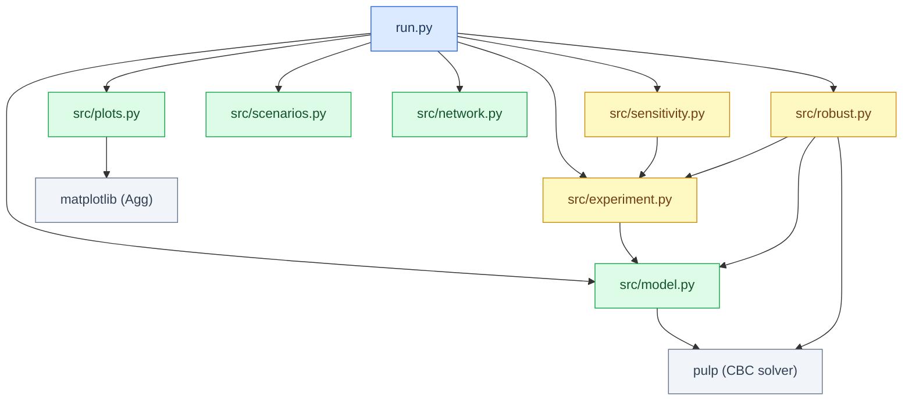
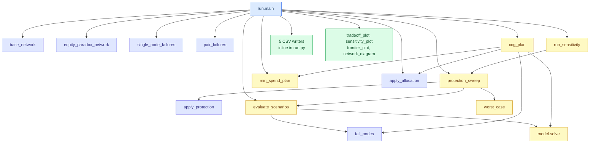
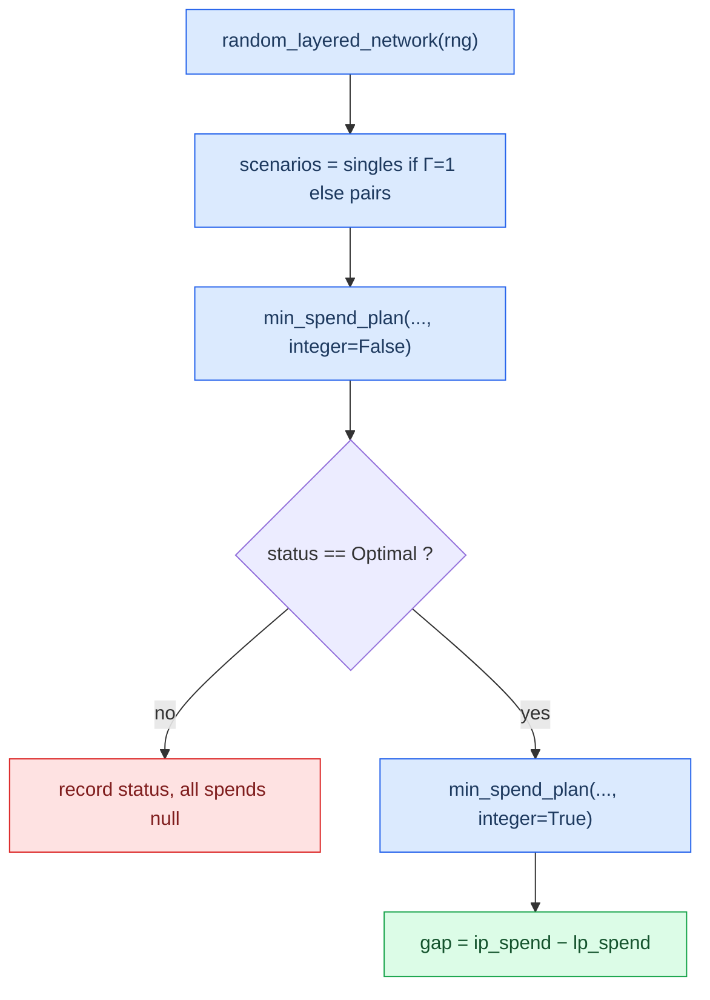

# Chapter 4 — Execution flow

There are three scripts that can be executed independently. Every script is
self-contained: it builds its own network, runs its own experiment and writes its
own artifacts. None of them imports another.

| Script | Command | Artifact list |
|---|---|---|
| [`run.py`](../run.py) | `python run.py` | `sweep.csv`, `sensitivity.csv`, `frontier.csv`, `plans.csv`, `paradox.csv`, `tradeoff.png`, `sensitivity.png`, `frontier.png`, `network.png` |
| [`run_scaled.py`](../run_scaled.py) | `python run_scaled.py [nS nF nW nH [seed]] [--pairs]` | `scaled.csv` |
| [`run_integrality.py`](../run_integrality.py) | `python run_integrality.py [count]` | `integrality.csv` |

All three scripts default to writing artifacts into `results/`. All three accept
`out_dir` as a keyword parameter to their `main()`, which is how the test suite
redirects them into a `tmp_path` — and how this documentation was verified
without overwriting the tracked figures.

## Main experiment: `run.py`

### Module dependencies graph



`src/model.py` is the only module that touches nothing else in the project, and
`src/network.py` imports nothing at all. Everything else builds upon that.

### Configuration constants

Defined at [`run.py:12-15`](../run.py), before `main`:

| Constant | Value | Used in |
|---|---|---|
| `LEVELS` | `[0.0, 0.05, ..., 0.50]` — 11 protection levels equally spaced | `run.py:23-25` |
| `TARGETS` | `[0.75, 0.8, 0.85, 0.9, 0.95, 1.0]` — 6 robust targets | `run.py:50` |
| `PARADOX_TARGET` | `0.55` | `run.py:91` |
| `PARADOX_SCENARIOS` | `[("W2",)]` — a single scenario | `run.py:91` |

`LEVELS` is generated with `round(i * 0.05, 2)` rather than simple float
arithmetic, so the levels are printed cleanly (`0.35`, not `0.35000000000000003`).
The *spend* column is not rounded, that's why you see `230.99999999999997` at
level 0.35.

### Execution stages in the actual order

Execution stages are listed below in the order they are executed. Note that the
CSV files are **not** written last: `sweep.csv` and `sensitivity.csv` are
written before the frontier calculation is completed. This interleaving is
accurate and preserved in the documentation below.

#### 1. Output directory creation — `run.py:19-20`

```python
out = Path(out_dir)
out.mkdir(parents=True, exist_ok=True)
```

With `parents=True` nested paths are created if needed, and `exist_ok=True` makes
reruns idempotent. **Output:** `Path` used for every following write operation.

#### 2. Network construction — `run.py:21`

| | |
|---|---|
| Function | `base_network()` |
| Location | [`src/network.py:79-90`](../src/network.py) |
| Input | none |
| Output | one network `dict`, 9 keys |
| Consumed by | all next stages |

#### 3. Scenarios generation — `run.py:23, 24, 25`

The function `single_node_failures(net)` is called **three times separately**
(`run.py:23, 25, 51, 69`) and returns every time the same list. The function
`pair_failures(net)` is called once at line 24.

| Function | Source | Output shape |
|---|---|---|
| `single_node_failures` | [`src/scenarios.py:8-9`](../src/scenarios.py) | `list[tuple[str]]`, length 9 |
| `pair_failures` | [`src/scenarios.py:12-13`](../src/scenarios.py) | `list[tuple[str, str]]`, length 36 |

#### 4. Uniform single-failure sweep — `run.py:23`

```python
singles = protection_sweep(net, LEVELS, single_node_failures(net))
```

| | |
|---|---|
| Function | `protection_sweep` |
| Location | [`src/experiment.py:43-56`](../src/experiment.py) |
| Input | network, 11 levels, 9 scenarios |
| Output | `list[dict]`, length 11; keys `level`, `spend`, `worst_satisfaction`, `worst_scenario`, `max_recovery_cost` |
| LP solves | $11 \times (1 + 9) = 110$ |
| Consumed by | `sweep.csv`, `tradeoff_plot`, `frontier_plot`, terminal summary, `protection_spend_at_full` |

Inside, for every level: `apply_protection` → `evaluate_scenarios` (one solve
for recovery cost baseline, then one per scenario) → `worst_case`.

#### 5. Uniform pair-failure sweep — `run.py:24`

Similar, with 36 scenarios. **LP solves:** $11 \times (1 + 36) = 407$.
**Consumed by:** `sweep.csv`, `tradeoff_plot`.

#### 6. Sensitivity analysis — `run.py:25`

```python
sensitivity = run_sensitivity(net, LEVELS, single_node_failures(net))
```

| | |
|---|---|
| Function | `run_sensitivity` |
| Location | [`src/sensitivity.py:18-29`](../src/sensitivity.py) |
| Output | `dict[str, list[dict]]` — 5 keys (`base`, `cost_x0.8`, `cost_x1.2`, `capacity_x0.8`, `capacity_x1.2`), each mapping to an 11-row sweep |
| LP solves | $5 \times 110 = 550$ |
| Consumed by | `sensitivity.csv`, `sensitivity_plot` |

This is the single most costly stage — one third of the entire execution.

#### 7. Writing `sweep.csv` — `run.py:27-40`

Combines `singles` and `pairs` into one 7-column table row by row. The strings
of the `worst_scenario` tuples are joined with `"+".join(...)`, so `("W1", "W2")`
becomes `"W1+W2"`.

#### 8. Writing `sensitivity.csv` — `run.py:42-47`

Long format: one row per (variant, level) pair, 55 data rows.

#### 9. Building the optimized frontier — `run.py:49-59`

```python
for target in TARGETS:
    plan = ccg_plan(net, single_node_failures(net), target)
    protected = apply_allocation(net, plan["extra"])
    achieved = worst_case(evaluate_scenarios(protected, single_node_failures(net)))
```

For each of the six targets, execute the C&CG algorithm, apply the allocation,
and **after that independently evaluate** the resulting network against all nine
scenarios. The latter step is an intentional crosscheck: it verifies with another
independent piece of code that the protection plan indeed achieves the goal.

| | |
|---|---|
| Functions | `ccg_plan` ([`src/robust.py:70-101`](../src/robust.py)), `apply_allocation` (lines 13-17), `evaluate_scenarios`, `worst_case` |
| Output | `list[dict]`, length 6; keys `target`, `spend`, `iterations`, `worst_satisfaction` |
| LP solves | 444 for all six targets |
| Consumed by | `frontier.csv`, `frontier_plot` |

Iteration counts seen: 2, 4, 7, 8, 9, 9.

#### 10. Writing `frontier.csv` — `run.py:61-67`

#### 11. Comparison of normal versus robust plan — `run.py:69-72`

```python
robust_plan = ccg_plan(net, single_node_failures(net), 1.0)
robust_net  = apply_allocation(net, robust_plan["extra"])
normal_rows = evaluate_scenarios(net, single_node_failures(net))
robust_rows = evaluate_scenarios(robust_net, single_node_failures(net))
```

`ccg_plan` at target 1.0 is recalculated **second time** here, after being
calculated once within the loop at line 51. It requires 89 redundant LP solves
(about 5% of the whole execution), but does not hurt anything. See
[Chapter 8](08-extension-guide.md#low-risk-cleanups-the-architecture-already-supports).

**Output:** two arrays of 9 rows each, aligned by scenario for the four metrics.
**Consumed by:** `plans.csv` and terminal summary.

#### 12. Writing `plans.csv` — `run.py:74-88`

Nine rows: cost / satisfaction / equity / recovery cost for the unprotected and
protected plan.

#### 13. Equity-paradox experiment — `run.py:90-96`

```python
paradox_net  = equity_paradox_network()
paradox_plan = min_spend_plan(paradox_net, PARADOX_SCENARIOS, PARADOX_TARGET)
paradox_rows = [
    ("unprotected", 0.0, solve(paradox_net)),
    ("protected", paradox_plan["spend"],
     solve(apply_allocation(paradox_net, paradox_plan["extra"]))),
]
```

Another network (see [`src/network.py:30-46`](../src/network.py)) and direct
application of `min_spend_plan` instead of `ccg_plan` — the former is
sufficient with just a single scenario, since there is nothing to select for the
latter. Note the two calls of `solve` evaluate the network **intact**, not
disrupted — the equity paradox is about how the protection plan changes the
normal optimal solution. **LP solves:** 3.

#### 14. Writing `paradox.csv` — `run.py:98-104`

#### 15. Four plots creation — `run.py:106-109`

```python
tradeoff_plot(singles, pairs, out / "tradeoff.png")
sensitivity_plot(sensitivity, out / "sensitivity.png")
frontier_plot(singles, frontier, out / "frontier.png")
network_diagram(net, out / "network.png")
```

Each of these functions receives a precalculated data structure. None of the
plotting functions solves LPs or touches the file system beyond its own output
path.

#### 16. Terminal summary — `run.py:111-121`

Prints the worst unprotected scenario, the first level that provides the full
protection, the optimized plan spend and number of iterations, and the uniform
plan spend at full protection via a helper function `protection_spend_at_full`
(`run.py:124-127`).

Expected output:

```text
worst scenario at p=0: ('S1',) (satisfaction 0.722)
worst case fully protected from level: 0.5
optimized full protection: spend 170.0 in 9 C&CG iterations (uniform needs 330.0)
outputs written to results/
```

`protection_spend_at_full` uses a `next(...)` call with no default value, so it
raises `StopIteration` in case when no level from the sweep provides full
protection. For the base network it always does, for a modified network — maybe
not.

### Call graph



### Cost of the full execution

Measured by overriding `pulp.LpProblem.solve` with a solve counter and running
`main` in a temporary directory: **1,623 LP solves**, execution time **≈36 s** on
the verification machine.

| Stage | LP solves | Share |
|---|---|---|
| Single-failure sweep | 110 | 6.8% |
| Pair-failure sweep | 407 | 25.1% |
| Sensitivity analysis (5 variants) | 550 | 33.9% |
| Optimized frontier (6 targets) | 444 | 27.4% |
| Duplicate `ccg_plan` at target 1.0 | 89 | 5.5% |
| Normal-vs-robust evaluation | 20 | 1.2% |
| Equity paradox | 3 | 0.2% |
| **Total** | **1,623** | 100% |

> **Documentation discrepancy.** The root `README.md` says "approximately
> 1,100 LP solves for the entire pipeline" (`README.md:119`) and "about two
> minutes" (`README.md:328`). The actual count is 1,623. The figure 1,067 —
> which indeed rounds to "approximately 1,100" — is exactly the three sweep
> stages
> ($110 + 407 + 550$), so the README's number apparently excludes the frontier,
> comparison and paradox stages. Runtime is hardware-dependent and the
> discrepancy is not evidence of a bug.

Outputs are deterministic: two consecutive executions produce exactly the same
byte-by-byte identical CSV files for all five artifacts.

## Scaling experiment: `run_scaled.py`

**Purpose.** Show that the whole pipeline — the generator, solver, scenario
enumeration, robust LP, C&CG — can work on a network considerably larger than
the hand-built one, and measure how long each approach takes.

### Function signature and constants

```python
SIZES = (10, 10, 10, 12)   # run_scaled.py:13
SEED  = 2026               # run_scaled.py:14

def main(sizes=SIZES, seed=SEED, include_pairs=False, out_dir="results"):
```

### Execution stages — `run_scaled.py:17-77`

| # | Line | Action | Output |
|---|---|---|---|
| 1 | 18-19 | Creation of `out_dir` | `Path` |
| 2 | 21 | `random_layered_network(Random(seed), sizes)` | network `dict` |
| 3 | 22 | `single_node_failures(net)` | 30 scenarios with default sizes |
| 4 | 23 | `solve(net)` — the baseline of intact network | `result dict` |
| 5 | 24 | `evaluate_scenarios(net, scenarios)` | 30 rows |
| 6 | 25 | `worst_case(rows)` | one row |
| 7 | 27-29 | **Timed** `min_spend_plan(net, scenarios, 1.0)` | `full`, `full_seconds` |
| 8 | 31-33 | **Timed** `ccg_plan(net, scenarios, 1.0)` | `iterative`, `ccg_seconds` |
| 9 | 35-37 | *Optional* pair failure worst case, only if `include_pairs` | row or `None` |
| 10 | 39-46 | Writing `scaled.csv` — one row per single-failure scenario | CSV |
| 11 | 48-63 | Assembly of the `summary` dict | 13 keys |
| 12 | 65-76 | Printing the summary | stdout |
| 13 | 77 | Returning `summary` | consumed by tests |

Returning the summary dict from `main` is what allows
[`tests/test_run_scaled.py`](../tests/test_run_scaled.py) to assert on the
numbers without parsing the CSV.

### Deterministic random generation

`Random(seed)` creates a **local** random generator
(`run_scaled.py:21`) rather than seeding the global `random` module. Two
consequences: the run cannot be influenced by other pieces of code working with
the global random state, and two runs with the same seed produce identical
results — verified by `test_scaled_run_is_deterministic`
(`tests/test_run_scaled.py:14-18`).

### Exhaustive LP versus C&CG timing comparison

It is the most informative output of the experiment, and its result goes against
an expectation. Results measured on default parameters:

```text
network (10, 10, 10, 12) seed 2026: 42 nodes, 99 arcs, 30 single-failure scenarios
baseline satisfaction 1.000, worst failure W3 -> 0.971
full LP: spend 24.0 in 0.13s
C&CG:    spend 24.0 in 3.15s (3 iterations)
```

Two methods produce the same spend of 24.0 — which is the point of the
comparison, and what `test_scaled_run_writes_outputs_and_matches_ccg_to_full_lp`
asserts. But **C&CG is about 24× slower**, because its oracle re-calculates all
30 scenarios on every iteration ($3 \times 30 = 90$ LP solves plus 2 master
LPs) while the full LP is the single LP solve of one larger model. See
[Chapter 3](03-mathematical-model.md#why-this-is-an-educational-implementation)
why it is expected behavior of an exhaustive oracle implementation.

Also notice the randomly generated instance is far **easier** than the
hand-built one: only two of 30 single failures cause any shortage at all (`W3`
with 0.971 and `W5` with 0.975 in `scaled.csv`); the rest 28 are covered
perfectly. Random instances are not calibrated to be fragile, so the scaling
experiment measures **throughput and algorithmic agreement**, not resilience
economics.

### Optional pair-failure calculation

Switched off by default. With 42 nodes, `pair_failures` would produce
$\binom{30}{2} = 435$ scenarios, and `evaluate_scenarios` would need 436 LP
solves. Enable it with the `--pairs` flag. It affects only the printed line and
`summary["pair_worst_satisfaction"]`; `scaled.csv` stays the same.

### `scaled.csv`

Four columns, one row per single-failure scenario: `failed`, `satisfaction`,
`min_fill_rate`, `recovery_cost`. Written from `rows` at
[`run_scaled.py:39-46`](../run_scaled.py). Note that it records the
*unprotected* evaluation only — the protection plans appear in the printed
summary, not in the CSV.

### Command-line arguments

Parsed at [`run_scaled.py:80-84`](../run_scaled.py):

```python
positional  = [a for a in sys.argv[1:] if a != "--pairs"]
chosen_sizes = tuple(int(a) for a in positional[:4]) if len(positional) >= 4 else SIZES
chosen_seed  = int(positional[4]) if len(positional) > 4 else SEED
main(chosen_sizes, chosen_seed, include_pairs="--pairs" in sys.argv)
```

| Invocation | Sizes | Seed | Pairs |
|---|---|---|---|
| `python run_scaled.py` | (10,10,10,12) | 2026 | no |
| `python run_scaled.py 5 5 5 6` | (5,5,5,6) | 2026 | no |
| `python run_scaled.py 5 5 5 6 42` | (5,5,5,6) | 42 | no |
| `python run_scaled.py 5 5 5 6 42 --pairs` | (5,5,5,6) | 42 | yes |
| `python run_scaled.py --pairs` | (10,10,10,12) | 2026 | yes |

`--pairs` may be placed anywhere; it is stripped before the positional parsing.
Two sharp edges: passing **one to three** positional arguments silently falls
back to the default sizes instead of raising an error, and `out_dir` is not
exposed on the command line at all.

## Integrality experiment: `run_integrality.py`

**Purpose.** Ask, over many random instances, how often the continuous
protection LP returns a fractional plan that an integer plan cannot match, and
by how much.

### Execution stages — `run_integrality.py:11-28`

```python
COUNT = 1000    # run_integrality.py:7
SEED  = 2026    # run_integrality.py:8

def main(count=COUNT, seed=SEED, out_dir="results"):
    out = Path(out_dir); out.mkdir(parents=True, exist_ok=True)
    with open(out / "integrality.csv", "w", newline="") as f:
        writer = csv.writer(f)
        writer.writerow(["gamma", "index", "status", "lp_spend", "ip_spend", "gap"])
        for gamma in [1, 2]:
            summary = run_integrality_experiment(count, seed, gamma)
            ...
```

The CSV file is opened **only once** and both γ blocks are dumped into it,
so `integrality.csv` contains always $2 \times \text{count}$ data rows.

### Randomly-generated instances repeated

`run_integrality_experiment` ([`src/integrality.py:21-39`](../src/integrality.py)):

```python
rng = random.Random(seed)
for index in range(count):
    network = random_layered_network(rng)          # consumes rng, so each differs
    scenarios = single_node_failures(network) if gamma == 1 else pair_failures(network)
    result = integrality_gap(network, scenarios, 1.0)
```

One `rng` is created per call and passed through every draw, so instance $i$
depends on all previous ones. The target is hardcoded to **1.0** at
[`src/integrality.py:29`](../src/integrality.py) — the experiment asks for full
protection always.

### Γ = 1 vs. Γ = 2

"Γ" stands for the budget of uncertainty — how many nodes may fail together.

| Γ | Scenario family | Count for 3/3/3/3 network |
|---|---|---|
| 1 | `single_node_failures` | 9 |
| 2 | `pair_failures` | 36 |

Since `main` provides **the same `seed`** for both γ values, both blocks get
*exactly the same sequence of networks*. This is a design choice made on purpose
and allows a direct comparison between two blocks.

### Continuous vs. integer plan solving and gap counting

`integrality_gap` ([`src/integrality.py:8-18`](../src/integrality.py)) solves
the LP first and returns if it is not `Optimal`; otherwise solves the MILP and
reports the gap.



Aggregation at [`src/integrality.py:31-39`](../src/integrality.py):

```python
feasible = [row for row in rows if row["status"] == "Optimal"]
gaps     = [row["gap"] for row in feasible if row["gap"] > 1e-6]
return {"instances": count, "feasible": len(feasible), "rows": rows,
        "gap_count": len(gaps), "max_gap": max(gaps, default=0.0)}
```

The `1e-6` tolerance suppresses solver round-off errors, so `gap_count` counts
only genuine gaps. `max(gaps, default=0.0)` covers the case of no gaps.

### Feasibility

An instance may be `Infeasible` since `random_layered_network` does not ensure
enough capacity expansion to meet the demand under all possible failures — with
Γ = 2, failure of two nodes may fully isolate a hospital, which cannot be fixed
with any extra capacity. Infeasible instances go to the CSV file with empty
`lp_spend`, `ip_spend`, and `gap` columns and are excluded from `feasible`.

### Reproducibility

Using `random.Random(seed)` with fixed default value of 2026 ensures
reproducibility of the entire experiment. Function `test_experiment_is_deterministic`
([`tests/test_integrality.py:29-32`](../tests/test_integrality.py)) asserts that
two runs with the same arguments generate the same dictionaries.

### Command-line arguments

```python
main(count=int(sys.argv[1]) if len(sys.argv) > 1 else COUNT)   # run_integrality.py:32
```

Only `count` is exposed. `seed` and `out_dir` are available from Python but
not from shell. With default `count=1000`, the current configuration will solve
$2 \times 1000$ instances, each with one LP and one MILP over 9 or 36 scenarios,
taking hours. **For testing purposes, use a smaller number of instances:**

```bash
python run_integrality.py 10
```

Output at count 10:

```text
gamma=1: 10 instances, 10 feasible, 1 with integrality gap, max gap 1.0
gamma=2: 10 instances, 6 feasible, 1 with integrality gap, max gap 1.0
```

---

Previous: [Chapter 3 — Mathematical model](03-mathematical-model.md) ·
Next: [Chapter 5 — File-by-file guide](05-file-by-file-guide.md)
