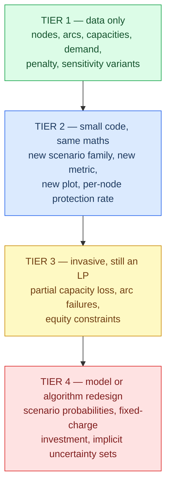

# Chapter 8 — Extension guide

How to change this repository without breaking it. Each section names the files
that change, the mathematical consequence, the tests that will fail, and the
assumptions at risk.

## Read this first: the blast radius of a data change

Several tests pin exact numbers that depend on the base network's constants.
**Any change to `src/network.py` will break some of them**, and that is by
design — those tests exist so a data edit cannot silently rewrite the published
results.

| Pinned value | Where asserted | Depends on |
|---|---|---|
| Total demand = 180 | [`tests/test_network.py:6`](../tests/test_network.py) | `DEMAND` |
| 9 single failures, 36 pairs | [`tests/test_scenarios.py:8, 17`](../tests/test_scenarios.py) | Tier list lengths |
| 9 rows from `evaluate_scenarios` | [`tests/test_experiment.py:55`](../tests/test_experiment.py) | Tier list lengths |
| Optimized spend = 170.0 | [`tests/test_integrality.py:15`](../tests/test_integrality.py) | Every capacity and arc |
| Uniform spend at full protection = 330.0 | [`tests/test_robust.py:44`](../tests/test_robust.py) | $\sum u_n = 660$ |
| Counterexample 106.5 / 107.0 / 0.5 | [`tests/test_integrality.py:38-40`](../tests/test_integrality.py) | `integrality_gap_network` |
| Paradox 0.5 / 0.4 | [`tests/test_paradox.py:11-12`](../tests/test_paradox.py) | `equity_paradox_network` |
| Calibration invariant | [`tests/test_network.py:42-47`](../tests/test_network.py) | Every capacity |
| Every failure causes a shortage | [`tests/test_experiment.py:18-22`](../tests/test_experiment.py) | Every capacity |
| `plans.csv` has 9 rows | [`tests/test_run.py:32`](../tests/test_run.py) | Tier list lengths |

**The workflow for any data change** is: make the edit, run `pytest`, and for
each failure decide deliberately whether the *new* number is correct. Do not
update the assertions first.

## What is supported, and what is not



---

# Tier 1 — Data-only changes

## Add a supplier, factory, or warehouse

**Files.** [`src/network.py`](../src/network.py) only: append to the tier
constant, add a `CAPACITY` entry, add at least one incoming arc (except for
suppliers) and at least one outgoing arc to `ARC_COST`.

**Mathematics.** $|N|$ grows by one, so single-failure scenarios grow by one and
pair scenarios by $|N|$ (from $\binom{9}{2}=36$ to $\binom{10}{2}=45$).
`min_spend_plan` gains one `extra` variable and $|K|$ new capacity constraints.
$\sum u_n$ grows, so every uniform `spend` value shifts.

**Tests to update.** The scenario counts in
[`tests/test_scenarios.py`](../tests/test_scenarios.py), the row count in
[`tests/test_experiment.py:55`](../tests/test_experiment.py), the 9-row check in
[`tests/test_run.py:32`](../tests/test_run.py), and both pinned spends. Re-check
the calibration invariant by hand before updating
[`tests/test_network.py:42-47`](../tests/test_network.py).

**Risks.**

- Adding a *small* node may break the invariant's second half
  ($\sum u - \max u < D$), because the tier total rises while the largest node
  does not. Some failures then become free and the resilience question goes
  vacuous for them.
- `network_diagram`'s hard-coded axis limits
  ([`src/plots.py:294-295`](../src/plots.py)) assume the 3/3/3/4 shape. A fourth
  node in a middle tier will overflow the frame.

## Add a hospital

Mechanically the same, but the consequences are larger, so it gets its own entry.

**Files.** `HOSPITALS`, `DEMAND`, and at least **two** incoming arcs in
`ARC_COST` — [`tests/test_network.py:29-33`](../tests/test_network.py) requires
in-degree ≥ 2, and for good reason: a single-sourced hospital is disconnected by
one failure, so its fill rate goes to 0 and `min_fill_rate` collapses to 0 in that
scenario.

**Mathematics.** $D$ changes, so **every satisfaction value in the entire project
changes**, including all the tracked figures. The number of failure scenarios
does *not* change — hospitals cannot fail.

**Tests to update.** `test_total_demand_is_180` by name and by value, both pinned
spends, and the calibration invariant (the tiers must still cover the new $D$).

**Risks.** If total demand rises above a tier's total capacity, the intact
network can no longer meet demand and `test_baseline_meets_all_demand`
([`tests/test_model.py:39-43`](../tests/test_model.py)) fails. Every result then
carries a baseline shortage and is much harder to interpret — this is exactly the
situation `equity_paradox_network` is deliberately in.

## Add or remove an arc

**Files.** [`src/network.py`](../src/network.py), `ARC_COST` only. Nothing else
tracks the arc set — see
[Chapter 2](02-network-and-data-model.md#arcs-are-dictionary-keys-not-a-separate-edge-list).

**Mathematics.** One more (or fewer) $x_{ij}$ variable per scenario copy: one in
`solve`, $|K|$ in `min_spend_plan`. Costs are unaffected structurally.

**Tests.** `test_arcs_only_connect_adjacent_tiers`
([`tests/test_network.py:17-26`](../tests/test_network.py)) enforces layering, and
`test_every_hospital_has_two_sources` (lines 29-33) enforces redundancy.

**Risks — and this is the one to think hardest about.**

Adding a single arc can **erase the project's headline structural finding.** Add
`("W3", "H1")` and `H1` is no longer confined to `{W1, W2}`. The
$\{W1, W2\}$ cut stops disconnecting 110 units, the pair-failure plateau at 38.9%
lifts, and `test_pair_target_above_topology_limit_is_infeasible`
([`tests/test_robust.py:48-51`](../tests/test_robust.py)) fails because full
protection against pairs becomes achievable.

That is not a bug — it is the finding working as intended. **Topology-driven
ceilings are removed by adding routes, not capacity**, and this is the cheapest
possible demonstration of it. If you add such an arc, expect to rewrite the
pair-failure narrative entirely.

Removing an arc has the mirror risk: it can create a new structural cut, or leave
a hospital single-sourced.

## Change capacities or demand

**Files.** `CAPACITY` and `DEMAND` in [`src/network.py`](../src/network.py).

**Mathematics.** Nothing structural changes; the LP has the same shape. But
`protection_spend` is $r \cdot p \cdot \sum u_n$, so changing any capacity moves
the x-axis of every uniform trade-off figure.

**Tests.** Both invariant tests, both pinned spends, and
`test_capacity_scaling_shifts_curve_in_right_direction`
([`tests/test_sensitivity.py:43-48`](../tests/test_sensitivity.py)) if the change
is large enough to flip a comparison.

**Risks.** The calibration invariant is a *pair* of inequalities and it is easy to
satisfy one while breaking the other. Check both:

$$\sum_{n \in T} u_n \ge D \quad\text{(intact feasibility)}, \qquad \sum_{n \in T} u_n - \max_{n \in T} u_n < D \quad\text{(non-trivial failures)}.$$

## Change the shortage penalty

**Files.** `SHORTAGE_PENALTY` at [`src/network.py:26`](../src/network.py).
Note this does **not** affect generated networks —
[`src/generator.py:40`](../src/generator.py) hard-codes `1000` as a literal.
Change both if you want consistency.

**Mathematics.** The penalty must satisfy

$$P > \sum_{(i,j) \in A} c_{ij}$$

to guarantee the LP maximizes delivery before minimizing shipping cost
([Chapter 3](03-mathematical-model.md#why-the-penalty-must-be-large)). On the base
network that sum is 47, so anything above ~50 preserves the ordering, and 1000
has ample margin. **Raising** the penalty changes nothing at all — the ordering is
already strict.

**Lowering it below the threshold changes the model's character**, and three
things break at once:

1. Satisfaction becomes cost-dependent. The solver may prefer paying a shortage
   over an expensive detour, so `test_cost_scaling_leaves_satisfaction_curve_unchanged`
   ([`tests/test_sensitivity.py:34-40`](../tests/test_sensitivity.py)) fails and
   `coinciding_variants` stops folding the cost variants.
2. `sensitivity.png` gains two visible curves, and the "no price sensitivity"
   finding disappears.
3. **C&CG can stop terminating.** Its convergence argument
   ([Chapter 3](03-mathematical-model.md#why-it-converges-and-why-it-is-optimal))
   requires the oracle's `solve` to achieve maximum delivery. If a low penalty
   makes `solve` accept a shortage the master proved avoidable, the oracle can
   re-select an already-chosen scenario and the `while True` loop at
   [`src/robust.py:74`](../src/robust.py) never exits. **There is no iteration
   cap.** Add one before experimenting with low penalties.

**Tests to add.** An assertion that $P > \sum c_{ij}$ for every network builder
would make this invariant explicit rather than tacit. It does not currently exist.

## Add a new sensitivity variant

**Files.** The `variants` dict at
[`src/sensitivity.py:19-25`](../src/sensitivity.py); `VARIANT_ORDER` and
`VARIANT_COLORS` at [`src/plots.py:15-22`](../src/plots.py).

**Mathematics.** None — this is a re-run, not a new model.

**Tests.** `test_run_sensitivity_returns_all_variants`
([`tests/test_sensitivity.py:26-31`](../tests/test_sensitivity.py)) asserts the
exact set of five names and will fail. Add a directional test for the new variant,
in the style of `test_capacity_scaling_shifts_curve_in_right_direction`.

**Risks.** Each variant costs $11 \times (1 + |K|) = 110$ LP solves — about 7% of
a full `run.py`. A variant omitted from `VARIANT_ORDER` sorts to position 99
([`src/plots.py:182`](../src/plots.py)) and renders in `MUTED` grey rather than
crashing, which is easy to miss.

---

# Tier 2 — Small code changes, same mathematics

## Add a new failure-scenario family

**Files.** [`src/scenarios.py`](../src/scenarios.py) — add a function returning
`list[tuple[str, ...]]`. Then pass it where `single_node_failures` is passed.

```python
from itertools import combinations

def triple_failures(network):
    return list(combinations(_failable_nodes(network), 3))
```

**Why this is easy.** Every downstream consumer is agnostic to $|\Phi_k|$.
`fail_nodes` iterates the tuple; `min_spend_plan` uses `if n in failed`; the CSV
writers use `"+".join(...)`. Nothing assumes scenarios have one or two elements.
That uniform tuple representation — including 1-tuples for singles — is what buys
this flexibility.

**Mathematics.** Enlarging the uncertainty set can only lower worst-case
satisfaction and raise required spend. It may make targets infeasible that were
previously achievable.

**Tests to add.** A counterpart to
[`tests/test_scenarios.py`](../tests/test_scenarios.py): the right count, all
distinct, no hospitals.

**Risks.** Combinatorial growth. $\binom{9}{3} = 84$ is fine; $\binom{30}{3} =
4{,}060$ is not — `min_spend_plan` would build $4{,}060 \times (99 + 12) \approx
450{,}000$ variables. Check the arithmetic before running.

## Add a new metric

There are **two kinds** of metric, and confusing them is the main trap.

### Report-only metrics

Anything computable from a solved flow. Add it to the return dict at
[`src/model.py:36-44`](../src/model.py), then thread it through the row dicts in
[`src/experiment.py:29-35`](../src/experiment.py) and the relevant CSV writer.

Example — the number of hospitals served below 50%:

```python
"hospitals_critical": sum(
    1 for h in hospitals if 1 - unmet_values[h] / demand[h] < 0.5
),
```

**Files.** `src/model.py`, `src/experiment.py`, the CSV writer in `run.py`, and
`src/plots.py` if it is to be drawn.

**Tests.** A unit test on `toy_chain`, plus one on the base network under a known
failure.

**Risks.** Row dicts are consumed positionally by the CSV writers. Adding a key
is safe; reordering or renaming an existing one breaks
[`tests/test_run.py`](../tests/test_run.py) and any external consumer of the CSVs.

### Constrainable metrics

If the metric is to appear in `min_spend_plan` as a target, it must be **linear**
in the decision variables. `min_fill_rate` is — and adding it would fix the equity
paradox. Insert alongside
[`src/robust.py:55`](../src/robust.py):

```python
for h in hospitals:
    prob += unmet[h] <= (1 - equity_target) * demand[h]
```

Mathematically this imposes $\text{fill}_h \ge \tau_{\text{eq}}$ for every
hospital in every scenario, which is exactly the max-min guarantee the current
model lacks.

**Consequences to expect.** Spend rises — you are adding constraints to a
minimization. Some targets become infeasible that were previously achievable.
`test_optimal_protection_raises_satisfaction_but_collapses_equity`
([`tests/test_paradox.py:15-21`](../tests/test_paradox.py)) will **fail**, and it
should: the paradox is the thing you just fixed. Make that a conscious decision,
not a silent assertion edit.

**What is not constrainable this way.** A Gini coefficient, a variance, or a
count of hospitals below a threshold are not linear in $s_h$. Gini needs
absolute-difference linearisation (many auxiliary variables); a count needs binary
indicators, which turns the LP into a MILP. Report them; do not constrain them
without changing the model class.

## Add a new plot

**Files.** [`src/plots.py`](../src/plots.py) plus a call in
[`run.py:106-109`](../run.py).

**The house pattern**, and each part matters:

```python
def my_plot(data, path):
    fig, ax = _styled_axes((7.5, 4.5))   # shared styling
    _line(ax, data, SINGLE_COLOR, "label")
    ax.set_xlabel(..., fontsize=10.5, color=SECONDARY_INK)
    ax.yaxis.set_major_formatter(PercentFormatter(xmax=1, decimals=0))
    ax.legend(frameon=False, fontsize=9, labelcolor=SECONDARY_INK)
    fig.savefig(path, bbox_inches="tight")
    plt.close(fig)                        # NOT optional
```

`plt.close(fig)` is required: the tests run plotting functions repeatedly in one
process, and matplotlib warns after 20 figures are left open. `_line` expects rows
with `spend` and `worst_satisfaction` keys — a different schema means plotting
inline, as `frontier_plot` does at
[`src/plots.py:123-134`](../src/plots.py).

**Tests to add.** A smoke test in
[`tests/test_plots.py`](../tests/test_plots.py) writing to `tmp_path`, and the new
filename in the `names` list at
[`tests/test_run.py:13-16`](../tests/test_run.py).

**Risks.** No test can detect a *wrong-looking* figure — there is no image
comparison. Inspect new figures by eye.

## Use a different protection-cost structure

### Per-node rates

Currently `protection_cost_rate` is a scalar. Making it a
`dict[str, float]` requires touching three expressions:

| Location | Current | Becomes |
|---|---|---|
| [`src/experiment.py:21`](../src/experiment.py) | `rate * level * sum(capacity.values())` | `level * sum(rate[n] * u for n, u in capacity.items())` |
| [`src/robust.py:30`](../src/robust.py) | `rate * lpSum(extra.values())` | `lpSum(rate[n] * extra[n] for n in nodes)` |
| [`src/robust.py:65`](../src/robust.py) | `rate * sum(extra_values.values())` | `sum(rate[n] * v for n, v in extra_values.items())` |

Also update all four network builders and
[`src/generator.py:41`](../src/generator.py), which hard-codes `1.0`.

**Mathematics.** Still linear, still an LP. But it changes the answer
qualitatively: with equal rates the optimizer buys where capacity is *needed*;
with differing rates it trades need against price and may buy more at a cheap
node to avoid an expensive one.

**Tests.** `test_protection_spend_is_linear_in_level`
([`tests/test_experiment.py:43-49`](../tests/test_experiment.py)) needs
generalising. Add a test that a cheap node absorbs more of the allocation.

### Nonlinear cost curves

The distinction that matters:

| Cost shape | LP-representable? | Why |
|---|---|---|
| Linear | Yes | Already the model |
| **Convex** piecewise-linear (rising marginal cost) | **Yes** | Split $e_n$ into per-segment variables with upper bounds; a minimizing LP fills cheap segments first, automatically and without integers |
| **Concave** piecewise-linear (economies of scale) | **No** | The LP would jump straight to the cheap high-volume segment without buying the earlier ones. Needs binary segment selectors |
| Fixed charge | No | See below |

Convex costs are a Tier-2 change: add segment variables in `min_spend_plan` and
sum them. Concave costs are Tier 4.

---

# Tier 3 — Invasive, but still a linear program

## Model partial capacity loss

**The idea.** Instead of "node destroyed", model "node loses 60% of capacity".

**The obstacle is representational, not mathematical.** A scenario is currently a
tuple of node names, with no room for a severity. It has to become something like
`dict[str, float]` mapping node → surviving fraction.

**Files.**

| File | Change |
|---|---|
| [`src/scenarios.py`](../src/scenarios.py) | New scenario representation and constructors |
| [`src/experiment.py:6-10`](../src/experiment.py) | `fail_nodes` multiplies instead of zeroing |
| [`src/robust.py:42-52`](../src/robust.py) | Replace the `if n in failed` branch with a multiplier |
| [`run.py`](../run.py), [`run_scaled.py`](../run_scaled.py) | Every `"+".join(nodes)` assumes strings |

**Mathematics.** The capacity becomes

$$\hat u^k_n = (1 - \delta^k_n)\,(u_n + e_n),$$

still linear in $e_n$, so the LP class is unchanged. Setting $\delta = 1$
recovers the current model exactly.

**A modelling decision you must make explicitly.** Is protection degraded along
with base capacity — $(1-\delta)(u + e)$ — or is it immune —
$(1-\delta)u + e$? The first says a flood halves the whole facility including its
new capacity. The second says the new capacity is a separate hardened asset.
Both are defensible; they give different answers; the current model cannot
distinguish them because $\delta \in \{0, 1\}$.

**Backwards compatibility.** Keep the tuple constructors working by treating a
tuple as "all listed nodes at $\delta = 1$". That preserves every existing test.

## Add arc failures

**The obstacle.** Arcs are **uncapacitated** in this model — only nodes have
capacity. There is no `arc_capacity` key, so "an arc fails" has no natural
expression.

**Two routes.**

*Route A — remove the arc per scenario.* Straightforward in
[`src/model.py`](../src/model.py), where arcs are read from the network at line 5.
But [`src/robust.py:21`](../src/robust.py) reads `arcs` **once**, before the
scenario loop, and reuses the same arc set for every scenario copy. Making the
arc set scenario-dependent means restructuring that loop.

*Route B — add arc capacities.* Introduce an `arc_capacity` dict, add
$x_{ij} \le \bar u_{ij}$ constraints in both models, and set the capacity to zero
for failed arcs. The arc set stays fixed, so the loop structure is untouched, and
arc protection becomes expressible too. **This is the cleaner route** despite
adding a key to the network dictionary.

**Files (Route B).** `src/network.py` (new key), `src/model.py` (new constraint
block), `src/robust.py` (same, per scenario), `src/scenarios.py` (arc-failure
constructors), `src/generator.py` (generate arc capacities).

**Mathematics.** Still an LP. But the structural analysis changes completely:
node cuts and arc cuts are different objects, and the $\{W1, W2\}$ finding would
need restating in terms of arc cuts.

**Risks.** Every network builder needs the new key or the constraint block must
tolerate its absence. The `network_diagram` would ideally show arc capacities
alongside costs, which the current label layout has no room for.

## Constrain equity

Covered under [constrainable metrics](#constrainable-metrics) above. Listed here
because although the code change is three lines, it changes what the model *is*:
from a satisfaction-targeting model to a jointly satisfaction- and
equity-targeting one, with a different feasible frontier and a different set of
achievable targets.

---

# Tier 4 — Requires model or algorithm redesign

## Add scenario probabilities

**This is the change that most looks small and is not.**

Mechanically it is easy: attach $p_k$ to each scenario and write

$$\sum_{k \in K} p_k \sum_{h \in H} s^k_h \le (1-\tau) D$$

instead of one constraint per scenario. Still linear. Still one LP.

**But it changes the question the project answers.** The current model is
**robust**: *every* scenario must meet the target, so the answer is a guarantee.
The probabilistic version is **stochastic**: the *average* must meet the target,
so a catastrophic-but-unlikely scenario can be traded away entirely. Worst-case
satisfaction becomes unbounded below, and the pair-failure plateau — the
project's most interesting finding — stops being expressible, because it is a
statement about a worst case.

**And the algorithm no longer fits.** `ccg_plan` selects the single worst scenario
and adds it. Under an expectation constraint, no single scenario is "the binding
one" — the constraint couples all of them. The correct algorithm for two-stage
stochastic programs is **Benders decomposition** (the L-shaped method), which
generates optimality *cuts* from recourse duals rather than adding scenario
blocks. `ccg_plan`'s convergence proof does not carry over.

**Files.** `src/scenarios.py` (representation), `src/experiment.py`
(probability-weighted aggregation instead of `min`), `src/robust.py` (objective
and constraint form, and a new algorithm), plus every plot whose y-axis is labelled
"worst-case".

**Recommendation.** Add this as a *parallel* model — `src/stochastic.py` — rather
than converting the existing one. The robust and stochastic answers are both
interesting, and the comparison between them would be a genuine result.

## Introduce fixed-charge or binary investment decisions

**The model.** Add a binary $y_n \in \{0,1\}$ meaning "expand node $n$ at all",
with a fixed charge $f_n$:

$$\min \; \sum_{n \in N} \left( f_n y_n + r_n e_n \right), \qquad e_n \le M y_n .$$

**Files.** [`src/robust.py:20-67`](../src/robust.py). The `integer` flag already
demonstrates the pattern for changing variable categories — this extends it.

**Choosing the big-M.** $M = D$ (total demand) is a valid and tight-enough bound:
no node ever needs more extra capacity than the entire network's demand. A loose
$M$ weakens the LP relaxation and slows branch-and-bound badly, so do not use
`1e9`.

**Mathematics.**

- The problem becomes a **MILP**. Branch-and-bound replaces the simplex method,
  and solve times become unpredictable rather than merely large.
- The **LP relaxation bound becomes loose.** Currently the integrality gap is
  under 1% ([Chapter 6](06-experiments-and-results.md#experiment-8--integrality));
  with fixed charges and big-M it will be much larger, and the LP answer stops
  being a useful approximation.
- **C&CG still works.** Its convergence argument depends only on scenarios being
  added one at a time and never repeating — not on convexity. Integer first-stage
  with continuous recourse is in fact the setting Zeng & Zhao's method was
  designed for. But each master solve is now a MILP, so iterations get much more
  expensive.
- **Economic behaviour changes qualitatively.** Fixed charges push the optimizer
  toward *concentrating* investment in a few nodes rather than spreading small
  amounts across many — the opposite of the current 8-node allocation.

**Tests.** New file. Verify that a fixed charge of zero reproduces the current
answer exactly (a strong regression check), that a large fixed charge reduces the
number of expanded nodes, and that big-M does not bind at the optimum.

**Risks.** Runtime. Also, the `min_spend_plan` return contract would need a
`selected` key or similar, and `ccg_plan` propagates only `extra`
([`src/robust.py:101`](../src/robust.py)) — the $y$ values would be silently
dropped between iterations.

## Scale to larger networks

The repository already runs at 42 nodes
([Chapter 6](06-experiments-and-results.md#experiment-7--scaling)). Making it run
at 500 requires addressing four bottlenecks, in this order.

### Bottleneck 1 — the C&CG oracle (the real one)

[`src/robust.py:77-83`](../src/robust.py) solves $|K|$ LPs **per iteration**.
This is why C&CG measured 3.15 s against the full LP's 0.13 s.

**The fix is a research step, not an engineering one.** Replace the explicit
scenario list with an **implicit uncertainty set** — "any $\Gamma$ of $|N|$ nodes
may fail" — and replace the exhaustive loop with a **separation problem**: an
optimization that finds the worst $\Gamma$-subset without enumerating candidates.
Typically that is a bilinear max-min reformulated via LP duality into a MILP with
binary failure indicators.

Only then does C&CG deliver the advantage it exists for. **Until this is done, no
scalability claim for C&CG in this repository is supportable** — its own timing
measurements say the opposite.

### Bottleneck 2 — scenario counts

`pair_failures` is $O(|N|^2)$: 435 scenarios at 30 failable nodes, 124,750 at 500.
Even enumerating them is prohibitive, let alone building a model with a recourse
copy per scenario. This is the same problem as Bottleneck 1 and the same fix
solves it.

### Bottleneck 3 — model construction

`inflow`/`outflow` at [`src/model.py:16-20`](../src/model.py) scan **every arc**
per node, giving $O(|N| \cdot |A|)$ construction per solve. At 500 nodes and 5,000
arcs that is 2.5 million tuple comparisons per LP — and `run.py` performs
thousands of LPs.

**The fix is mechanical:** pre-index arcs by endpoint once per solve.

```python
from collections import defaultdict
incoming, outgoing = defaultdict(list), defaultdict(list)
for a in arcs:
    outgoing[a[0]].append(a)
    incoming[a[1]].append(a)
```

Construction drops to $O(|A|)$. The same pattern applies to
[`src/robust.py:36-40`](../src/robust.py), where it is repeated per scenario and
therefore matters more.

### Bottleneck 4 — the solver

CBC is bundled and free, and it is the slowest of the mainstream options. PuLP can
target HiGHS, Gurobi, or CPLEX by changing one argument at
[`src/model.py:30`](../src/model.py). HiGHS is open-source and typically several
times faster than CBC on problems of this shape.

### Not a bottleneck, but it will break

`network_diagram` hard-codes axis limits for a 3/3/3/4 network
([`src/plots.py:294-295`](../src/plots.py)). It is unusable above about a dozen
nodes and would need a different layout algorithm.

---

## Low-risk cleanups the architecture already supports

Improvements that do not change any result. Each was observed while writing this
documentation.

| Cleanup | Where | Benefit |
|---|---|---|
| Reuse the $\tau = 1.0$ C&CG plan from the frontier loop instead of recomputing it | [`run.py:69`](../run.py) duplicates [`run.py:51`](../run.py) | Saves 89 LP solves, ~5% of the run |
| Call `single_node_failures(net)` once and reuse | [`run.py:23, 25, 51, 69`](../run.py) | Clarity; the cost itself is negligible |
| Write `max_recovery_cost_pairs` to `sweep.csv` | [`run.py:35-40`](../run.py) — it is already computed and discarded | A metric currently lost |
| Give `protection_spend_at_full` a default | [`run.py:125-127`](../run.py) raises `StopIteration`; the parallel lookup at line 112 passes `None` | Consistent behaviour on networks that never reach full protection |
| Add an iteration cap to `ccg_plan` | [`src/robust.py:74`](../src/robust.py) is `while True` | Turns a potential infinite loop into a diagnosable error |
| Assert $P > \sum c_{ij}$ in the network builders | [`src/network.py`](../src/network.py) | Makes the penalty-dominance invariant explicit rather than tacit |
| Expose `seed` and `out_dir` on `run_integrality.py`'s CLI | [`run_integrality.py:32`](../run_integrality.py) | Parity with the Python API |
| Guard against `spend is None` before formatting | [`run_scaled.py:71-72`](../run_scaled.py) raises `TypeError` on an infeasible instance | A clear message instead of a traceback |

These are observations, not instructions. **None has been applied** — this
documentation pass made no source changes.

---

Previous: [Chapter 7 — Testing and validation](07-testing-and-validation.md) ·
Next: [Glossary](glossary.md)
